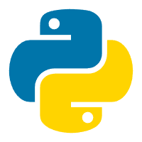

<div align="center">

<!-- Wave SVG Header -->


**少想多做 • 循序渐进 • 深入思考** | 大二在读 | 励志成为 Java 后端工程师 🔥 目前正在找实习中

[](https://jacksonling.cn/)
[](https://github.com/jackson-ling)
[](https://gitee.com/jacksonling)
[](https://blog.csdn.net/jackson0607)

</div>

---

<!-- About Section -->

## 关于项目

一个基于 **VitePress** 搭建的个人知识文档站点，系统性地记录了从 Java 基础语法到后端工程化开发的完整学习路径。内容涵盖 **Java SE**、**算法与数据结构**、**后端框架**、**前端基础**、**Python** 以及 **AI 应用**等多个方向，致力于构建清晰、可复用的技术知识体系。

---

<!-- Tech Stack -->

## 技术栈

<div align="center">


</div>

---

<!-- Content Sections -->

## 内容板块

<table>
  <tr>
    <td align="center" width="130">
      <br />
      <b>Java</b>
    </td>
    <td>
      韩顺平 Java 三阶段完整笔记（基础语法 → 面向对象高级 → 网络编程/JDBC/正则），配套章节练习题、IDEA / Maven 环境搭建
    </td>
  </tr>
  <tr>
    <td align="center">
      <br />
      <b>算法</b>
    </td>
    <td>
      代码随想录训练营、灵神题单、蓝桥杯真题、洛谷题单、左程云算法课、常用数据结构（Java 实现）
    </td>
  </tr>
  <tr>
    <td align="center">
      <br />
      <b>后端</b>
    </td>
    <td>
      MySQL / Redis / Spring / MyBatis / SpringBoot / MyBatis Plus，设计模式与项目实战笔记，Linux / Docker / Git DevOps 内容
    </td>
  </tr>
  <tr>
    <td align="center">
      <br />
      <b>前端</b>
    </td>
    <td>
      HTML / CSS / JavaScript / TypeScript 基础，Vue 框架、Element Plus 组件库、微信小程序开发
    </td>
  </tr>
  <tr>
    <td align="center">
      <br />
      <b>Python</b>
    </td>
    <td>
      PyCharm 环境搭建、爬虫（Urllib / Selenium / Scrapy）、数据分析（NumPy / Pandas / Matplotlib）
    </td>
  </tr>
  <tr>
    <td align="center">
      <span style="font-size:48px">🤖</span><br />
      <b>AI</b>
    </td>
    <td>
      AI 基础认知、Claude Code 实践、SpringAI / LangChain4j 集成、Ollama 本地部署、ROS2（AIC 大赛）
    </td>
  </tr>
  <tr>
    <td align="center">
      <br />
      <b>408</b>
    </td>
    <td>
      高等数学、线性代数、概率论、数据结构、计算机组成原理、操作系统、计算机网络
    </td>
  </tr>
</table>


---

<!-- Quick Start -->

## 快速开始

### 环境要求

- **Node.js** >= 18.0.0 < 19.0.0
- **包管理器**：npm / pnpm / yarn

### 本地运行

```bash
# 克隆仓库
git clone https://github.com/jackson-ling/vitepress.git
cd vitepress

# 安装依赖
npm install

# 启动开发服务器
npm run docs:dev
```

浏览器访问 `http://localhost:5173` 即可预览。

### 构建与预览

```bash
# 构建生产版本
npm run docs:build

# 本地预览构建产物
npm run docs:preview
```

---

<!-- Project Structure -->

## 项目结构

```
├── .vitepress/
│   ├── config.mjs          # 站点配置（导航栏、侧边栏、主题等）
│   ├── gen_sidebar.js       # 侧边栏自动生成工具
│   └── theme/               # 自定义主题覆盖
├── docs/                    # 文档内容
│   ├── Java/                # Java SE 三阶段笔记 + 练习题
│   ├── 算法/                # 算法训练、竞赛题解
│   ├── 后端/                # 框架笔记、数据库、DevOps
│   ├── 前端/                # 前端基础与框架
│   ├── Python/              # Python 基础与爬虫
│   ├── AI/                  # AI 相关技术
│   ├── 408/                 # 考研专业课
│   └── 项目/                # 项目实战笔记
├── public/                  # 静态资源（图标、图片）
├── index.md                 # 首页
├── index.html               # 入口 HTML
└── package.json
```

---

<!-- Custom Config -->

## 自定义配置

站点配置集中在 `.vitepress/config.mjs`，侧边栏通过 `gen_sidebar.js` 自动生成，可按需修改导航、搜索、主题等配置。

---

<!-- Contact -->

## 联系作者

> 目前大二在读，励志成为优秀的 Java 后端工程师，目前正在找实习中......
>
> 若网站笔记有误和不足，或学习交流，欢迎通过以下方式联系

<div align="center">

[](https://github.com/jackson-ling)
[](https://gitee.com/jacksonling)
[](https://blog.csdn.net/jackson0607)
[](https://jacksonling.cn/docs/Contact.html)

</div>

---

<!-- Star History -->

## Star History

<div align="center">

<a href="https://star-history.com/#jackson-ling/vitepress&Date"></a>

</div>

---

<!-- Footer Wave -->

<div align="center">

**License**

[](./LICENSE)

Copyright &copy; 2025 Jackson 凌 | 粤ICP备2025441629号-1

</div>
