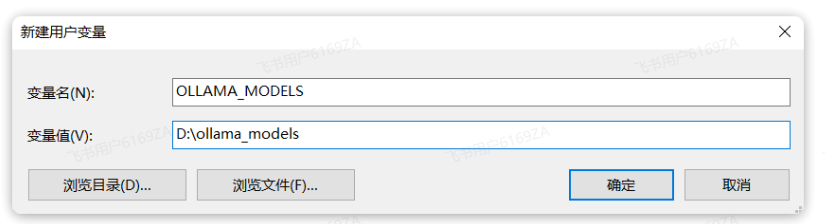

<h1 style="text-align: center;">Ollama</h1>
 
- - -

## 官方网址

> #### https://ollama.com/

## 本地访问端口

> #### `http://127.0.0.1:11434`

## 本地安装

> #### Ollama 默认安装目录是 C 盘的用户目录，如果不希望安装在 C 盘的话，就不能直接双击安装了，需要通过命令行安装，首先新增并配置环境变量



```bash
OllamaSetup.exe /DIR=你要安装的目录位置
```

## 常用命令

```bash
ollama serve      # 启动 Ollama 服务
ollama create     # 根据 Modelfile 创建模型
ollama show       # 查看模型信息
ollama run        # 运行模型
ollama stop       # 停止正在运行的模型
ollama pull       # 从模型仓库拉取模型
ollama push       # 将模型推送到模型仓库
ollama list       # 列出本地模型
ollama ps         # 列出正在运行的模型
ollama cp         # 复制模型
ollama rm         # 删除模型
ollama help       # 查看命令帮助
```
