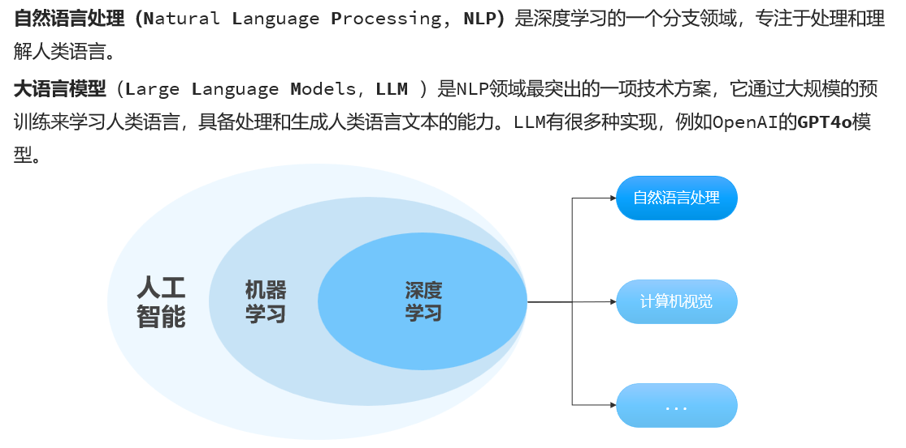
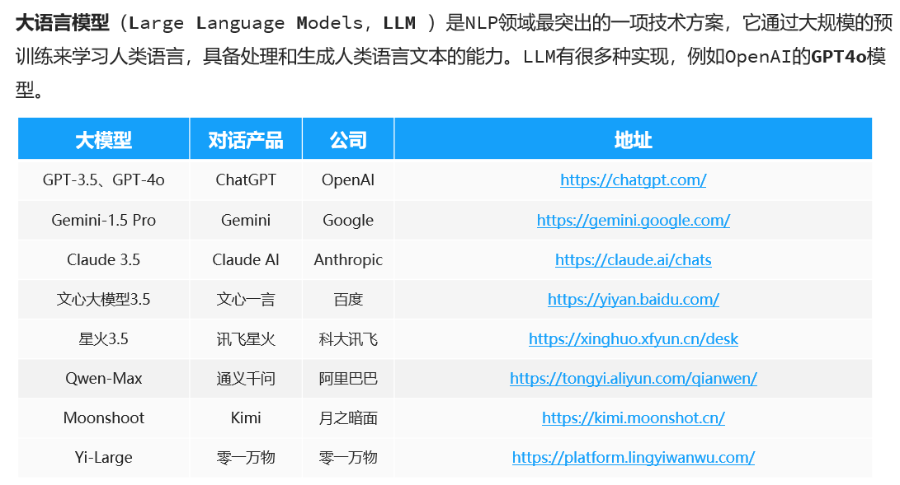
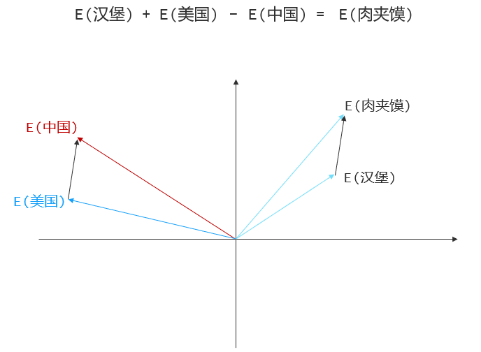
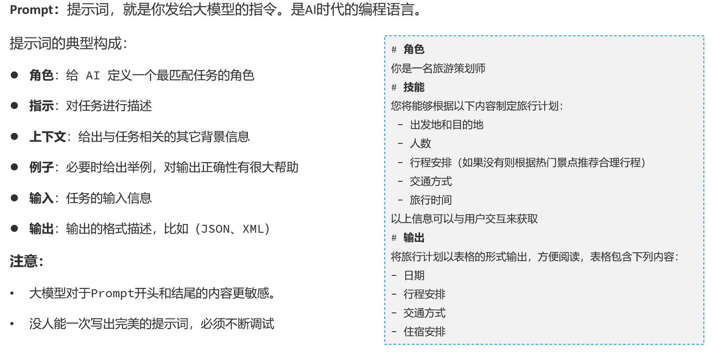
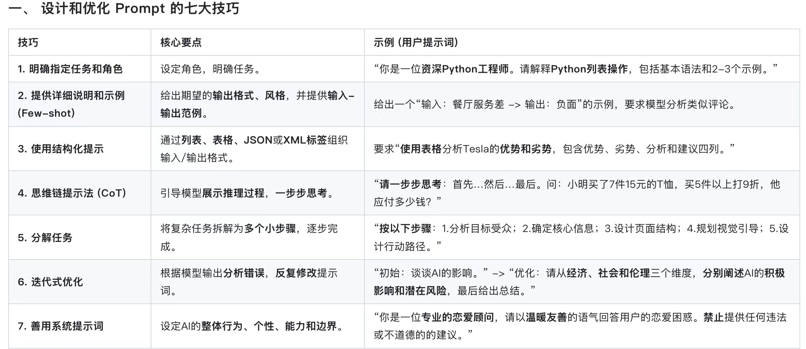
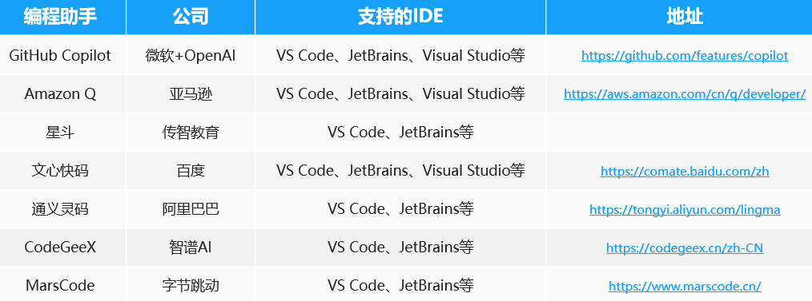

<h1 style="text-align: center;">认识 AI</h1>

---

## 核心概念扫盲

> #### 马克（视频教程）：https://www.bilibili.com/video/BV1E7wtzaEdq/
>
> #### 鱼皮（文字教程）：https://juejin.cn/post/7613234803012321314

## 什么是 AI

### 发展历程

<br/>


### 大语言模型

<br/>

<br/>


## GPT 原理分析

### 基本介绍

<br/>


> #### Transformer：（1）翻译转换（2）声音转文本（3）推理预测...

### 文本向量化

#### （1）将文本转成一组浮点数，放入一个数组，作为多维空间坐标

#### （2）通过训练调整向量坐标，使其在不同方向具备含义（GPT3 采用 12288 维空间）

<br/>


### 注意力机制

<br/>


> #### 通过更多的关键词，使得向量坐标更精确，可以使得回答的内容更准备
>
> #### 在上下文处理中，大模型对文本的的处理有限制，较长的文本可能会导致处理预期效果降低，同时等待回答的时间也越长，底层执行的计算量也是很大的

### GPT 的应用

<br/>


## AI 编程开发

### 基本介绍

<br/>


### prompt 提示词

> #### 优质提示词：https://github.com/ai-boost/awesome-prompts


<br/>


### AI 编程助手推荐

<br/>


### AI 应用开发

<br/>


## AI 技术架构

### 基本介绍

<br/>


### Prompt


### Function Calling


### RAG


## Prompt 编写原则

### User Prompt

> #### （1）目标明确：要做什么？分析、总结、改写、生成代码，得明说。"帮我看看这个日志"不是目标，"帮我分析这段日志里的报错原因并给出排查方向"才是
>
> #### （2）背景充足：大模型不知道你的业务、你的系统架构、你的团队惯例，它只能靠你给的信息推断。背景给得越充分，它越不需要乱猜，幻觉越少
>
> #### （3）输出要求：格式、长度、风格，不说，它随心所欲。你想要 Markdown 列表？想要 JSON？想要 3 条以内？一定要在 Prompt 里讲清楚

### System Prompt

> #### （1）身份设定：给模型一个具体的角色

```
你是一个 OnCall 助理，专门帮助工程师排查和分析系统故障。
你只处理与系统稳定性、报警分析、故障排查相关的问题。
```

> #### （2）行为规则：定义模型"能做什么、不能做什么"

```
不允许回答与系统故障无关的话题。
如果你不确定某个判断，必须说明"我不确定，建议进一步验证"。
不要自行假设任何背景信息，只根据用户提供的内容作答。
```

> #### （3）输出格式约束：让模型每次都按固定格式输出

```
你的回答必须是 JSON 格式，包含以下字段：
summary：对问题的一句话概括
root_cause：可能的根本原因列表
action_items：建议的排查步骤列表
```

### 6 大原则

#### 原则 1：给模型"角色"，效果立刻不同

> #### ❌ 「分析一下这个系统报错」
>
> #### ✅ 「你是一个资深 SRE 工程师，专门排查分布式系统故障，请分析以下报错」
>
> #### 加了角色之后，效果为什么会更好？不是玄学
>
> #### 大模型在训练时见过海量各行各业的文字，"资深 SRE 工程师写的内容"和"普通人随便聊的内容"，在语言风格、专业度、思考方式上差别很大。你指定了角色，就相当于告诉模型"往那个方向走"，缩小了 next-token 预测的搜索空间，输出自然更专业、更贴合你的期望

#### 原则 2：正向约束 > 负向禁止

> #### ❌ 「不要太啰嗦」→ "啰嗦"是主观的，模型不知道你的标准在哪
>
> #### ✅ 「回答控制在 3 句话以内」→ 明确，模型知道怎么执行
>
> #### 告诉模型"要做什么"，比告诉它"不要做什么"更有效。原因很直接：模型是在"生成"内容，知道要生成什么比知道不要生成什么更容易执行。负向的禁止在某些场景有用，但大多数情况下，直接说你想要的结果，效果更稳定

#### 原则 3：喂给它足够的背景信息（上下文）

> #### 大模型不知道你的业务逻辑，不知道你的系统架构，不知道这条报警对你的团队意味着什么。它只能靠你在 Prompt 里提供的信息来推断
>
> #### ❌ 「帮我分析问题」→ 什么问题？
>
> #### ✅ 「以下是系统日志，背景是我们的 MySQL 集群在高峰期（每天 12:00-14:00）出现连接超时，集群规模是 3 主 6 从，请分析可能原因：[日志内容]」
>
> #### 信息给得越充分，答案越靠谱，幻觉越少。大模型的"幻觉"有很大一部分来自"信息不足时的强行推断"，你给够了信息，它就不需要猜了

#### 原则 4：指定输出格式（Agent 开发的重中之重）

> #### 这一条在 Agent 开发中尤其关键，单独强调
>
> #### Agent 需要程序来解析大模型的输出，然后决定下一步做什么。如果输出格式每次不一样，解析代码就会频繁出错。所以你必须明确告诉模型"以什么格式输出"：JSON、Markdown 列表、固定字段……
>
> #### 光说"输出 JSON"还不够稳定。最可靠的方式是 在 Prompt 里直接给一个 JSON 示例：
>
> #### 请按以下 JSON 格式输出，不要输出其他内容

```json
{
  "severity": "high/medium/low",
  "summary": "一句话概括",
  "actions": ["步骤1", "步骤2"]
}
```

> #### 有了示例，模型的格式几乎不会跑偏
>
> #### 另外，这一条直接铺垫了我们后面要学的 Function Calling ：让大模型按照指定格式输出"要调用哪个工具、传什么参数"，本质上就是在做精确的格式约束，先理解这一条，Function Calling 的原理你就秒懂了

#### 原则 5：Few-shot，给几个例子，胜过写一堆规则

> #### Few-shot 是指：在 Prompt 里直接给几组"输入→输出"的示范样本，让模型照着这个模式来做
>
> #### ❌ 写一大段规则描述："回答时要简洁、专业、聚焦根因、避免技术术语过多……"
>
> #### ✅ 直接给 3 个样本，每个样本是一条报警 + 对应的分析结论，然后让模型对第 4 条做同样的分析
>
> #### 与其写一本厚厚的"员工行为手册"，不如直接给他看 3 份"合格工作成果的样本"，哪个更直接，一目了然
>
> #### 什么时候用 Few-shot：当你要模型输出特定风格、特定格式、特定思维方式的时候，用样本比用文字规则更直接、更有效。尤其是当你发现光靠描述说不清楚"我想要什么"时，直接给例子

#### 原则 6：让模型"先思考，再回答"（思维链 Chain of Thought）

> #### 处理复杂问题时，直接让模型给出答案，容易出错。在 Prompt 里加一句「请先逐步分析，再给出最终结论」，准确率会明显提升
>
> #### 这不是神秘技巧，背后有清晰的道理：大模型是 next-token 逐步生成的。当它把推理过程写出来，后续生成的每个 token 都能"参考"前面已经写出来的推理内容，逻辑更连贯，不容易发生逻辑跳跃
>
> #### 类比：让学生解数学题，"直接写答案"和"写出解题步骤再得出答案"，后者出错率低得多。不是步骤本身有魔力，而是写步骤的过程迫使模型在每一步都做出更谨慎的判断
