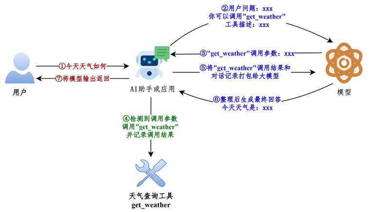
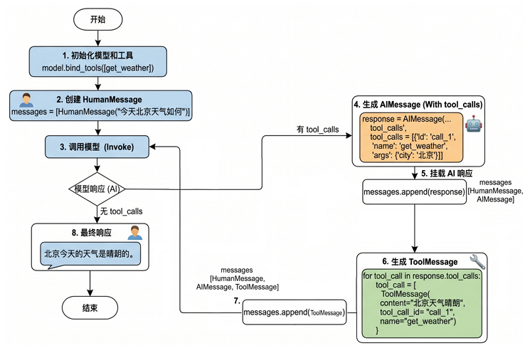
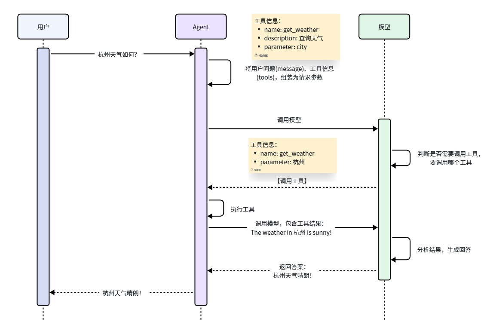
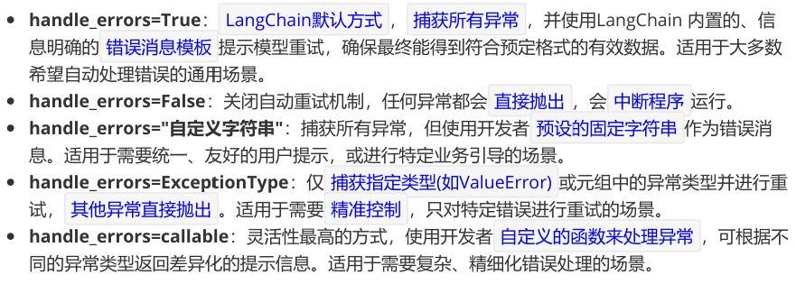

<h1 style="text-align: center;">LangChain 使用</h1>

## 模型初始化

### ChatXXX

> #### LangChain 为一些大模型供应商提供了专门的 Model 类，导入对应的具体类（如 ChatOpenAI、ChatAnthropic、ChatDeepSeek、ChatOllama、ChatHunyuan、ChatTongyi、ChatZhipuAI）并进行实例化。
>
> #### https://reference.langchain.com/python/langchain-community/chat-models
>
> #### 创建 .evn 文件编写配置，模型调用参数可由源码查看，不同模型的 url，key 的表达方式可能不同

```python
from dotenv import load_dotenv
from langchain_deepseek import ChatDeepSeek

# 1、读取.env配置文件中的信息。相关的环境变量以.env文件中的优先
load_dotenv(override=True)

# DEEPSEEK_API_KEY = os.getenv("DEEPSEEK_API_KEY")
# DEEPSEEK_BASE_URL = os.getenv("DEEPSEEK_BASE_URL")

# 2、模型的初始化
# 源码中有相关的代码会取读取环境变量中的 key 和 url，所以这里可以省略不写
llm_deepseek = ChatDeepSeek(
    model="deepseek-v4-flash",
    # api_key=DEEPSEEK_API_KEY,
    # api_base=DEEPSEEK_BASE_URL,
)

# 3、模型的调用
response= llm_deepseek.invoke("请用一句话介绍你自己")
print(response)
```

### OpenAI 兼容写法

> #### LangChain 没有为所有大模型厂商提供专用接口，如果选用的平台没有专用接口，可以通过兼容接口调用，大多数 API 平台都支持 OpenAI API 接口规范，所以基本都可以通过 ChatOpenAI 集成
>
> #### LangChain 大模型集成列表：https://docs.langchain.com/oss/python/integrations/chat#featured-models

```python
from langchain_openai import ChatOpenAI

# 加载配置文件
load_dotenv(override=True)

DEEPSEEK_API_KEY = os.getenv("DEEPSEEK_API_KEY")
DEEPSEEK_BASE_URL = os.getenv("DEEPSEEK_BASE_URL")

# 获取大模型
model = ChatOpenAI(
    model="deepseek-v4-flash",
    api_key=DEEPSEEK_API_KEY,
    base_url=DEEPSEEK_BASE_URL,
)

print(model.invoke("1 + 1 = ？"))
```

### init_chat_model

> #### 该方法会根据模型名称做自动推断，进而调用 ChatXXX 实现模型初始化
>
> #### 并非所有的模型都支持自动推断，如 model 名称 qwen-plus 不支持自动推断，可以通过参数 <span style="color:red">model_provider</span> 指定模型供应商
>
> #### 像阿里的 dashscope 尚未被 LangChain 官方纳入模型的统一注册体系，暂时不知道"dashscope"的提供者是谁。此时可以将 model_provider 设置为 <span style="color:red">openai</span>，底层将会用 openai 的规范处理请求，这就要求我们调用的模型服务是 OpenAI Compatible 的

#### 支持的 providers 有如下

```
anthropic , anthropic_bedrock, azure_ai, azure_openai,
bedrockbedrock_converse, cohere, deepseek , fireworks,
google_anthropic_vertex, google_genai, google_vertexaigrog,
huggingface, ibm, mistralai, nvidia, ollama, openai,
openrouter, perplexity, together, upstage, xai
```

#### （1）基本语法

```python
from langchain.chat_models import init_chat_model
model = init_chat_model(
    "provider:model_name",  # 提供商:模型名称
    api_key="your-api-key",  # API 密钥（可选，可从环境变量读取）
    temperature=0.7,         # 温度参数（可选）
    max_tokens=1000,         # 最大 token 数（可选）
    **kwargs                 # 其他模型特定参数
)
```

#### （2）阿里百练平台示例

```python
from langchain.chat_models import init_chat_model
from dotenv import load_dotenv
import os

load_dotenv(override=True)

DASHSCOPE_API_KEY=os.getenv("DASHSCOPE_API_KEY")
DASHSCOPE_BASE_URL=os.getenv("DASHSCOPE_BASE_URL")

model = init_chat_model(
    model="qwen-plus",
    model_provider="openai",
    api_key=DASHSCOPE_API_KEY,
    base_url=DASHSCOPE_BASE_URL)

print(model.invoke("你好，用一句话回答"))

# 在 .env 文件中填写环境变量
DASHSCOPE_BASE_URL=https://dashscope.aliyuncs.com/compatible-mode/v1
DASHSCOPE_API_KEY=<YOUR_API_KEY>
```

#### （3）deepseek 平台示例

> #### 模型与提供商可简化写为 -> <span style="color:red">model="模型提供商：模型"</span>，无需指定 model_provider

```python
import os
from langchain.chat_models import init_chat_model
from dotenv import load_dotenv

# 从.env文件中加载环境变量
load_dotenv(override=True)

# 从环境变量读取配置
DEEPSEEK_API_KEY = os.getenv("DEEPSEEK_API_KEY")
DEEPSEEK_BASE_URL = os.getenv("DEEPSEEK_BASE_URL")

model = init_chat_model(
    model="deepseek:deepseek-v4-flash", # 模型提供商简化写法
    #model_provider="deepseek",
    api_key=DEEPSEEK_API_KEY,
    base_url=DEEPSEEK_BASE_URL)

# 向模型发送单条数据
response = model.invoke("你好，用一句话回答")

# 打印响应
print(response)
```

### 模型初始化参数

| 参数           | 类型  | 说明                                                                                                                                          | 默认值 |
| -------------- | ----- | --------------------------------------------------------------------------------------------------------------------------------------------- | ------ |
| model          | str   | 使用的特定提供商的模型名称（必需）。<br>比如：openai:gpt-4o、groq:gemma2-9b-it                                                                | 无     |
| model_provider | str   | 模型提供商名称                                                                                                                                | 无     |
| api_key        | str   | API 密钥。如果不提供，会从环境变量中读取（如 DEEPSEEK_API_KEY）                                                                               | None   |
| base_url       | str   | 大模型供应商 API 请求地址。                                                                                                                   | None   |
| temperature    | float | 控制输出随机性，范围 0.0-2.0，温度越高输出越随机。<br>- 0.0：最确定性，输出几乎不变<br>- 1.0：平衡创造性和一致性<br>- 2.0：最随机，最有创造性 | 0.7    |
| max_tokens     | int   | 限制模型输出的最大 token 数量                                                                                                                 | None   |
| timeout        | float | 超时时间（秒），超时未响应，请求会被取消。                                                                                                    | None   |
| max_retries    | int   | 请求失败（如网络问题、速率限制）时的最大重试次数                                                                                              | 6      |

### Token 是什么

#### （1）基本单位: 大模型通过分词器（Tokenizer）将文本拆分后的最小语义单元是 token（相当于自然语言中的词或字），不同的模型采用不同的分词算法（如 BPE、WordPiece），因此同一段文本在不同模型中的 Token 数量可能不同

#### （2）收费依据：大语言模型通常也是以 token 的数量作为其计量（或收费）的依据

> #### 1 个中文 Token≈1-1.8 个汉字，1 个英文 Token≈3-4 个字符
>
> #### Token 与字符转化的可视化工具：
>
> #### OpenAI 提供：https://platform.openai.com/tokenizer
>
> #### 百度智能云提供：https://console.bce.baidu.com/support/#/tokenizer

### Ollama 调用

```python
from langchain.chat_models import init_chat_model

ollama_llm = init_chat_model(
model="deepseek-r1:1.5b",
model_provider="ollama", # 指定模型提供商实现推断
# base_url="http://192.168.1.106:11434",
)

question = "你好，请你介绍一下你自己。"

result = ollama_llm.invoke(question)

print(result)
```

## 模型调用

### 消息类型

| 消息类        | 对应字典格式                                                | 作用         |
| ------------- | ----------------------------------------------------------- | ------------ |
| SystemMessage | `{"role": "system", "content": "..."}`                      | 系统提示     |
| HumanMessage  | `{"role": "user", "content": "..."}`                        | 用户输入     |
| AIMessage     | `{"role": "assistant", "content": "..."}`                   | AI 回复      |
| ToolMessage   | `{"role": "tool", "content": "...", "tool_call_id": "..."}` | 工具调用结果 |

### 普通调用

```python
from langchain.chat_models import init_chat_model
import os
from dotenv import load_dotenv

# 加载配置文件
load_dotenv(override=True)

CLOSEAI_API_KEY = os.getenv("CLOSEAI_API_KEY")
CLOSEAI_BASE_URL = os.getenv("CLOSEAI_BASE_URL")

# 获取大模型
model = init_chat_model(
    model="openai:gpt-5.4-mini",
    api_key=CLOSEAI_API_KEY,
    base_url=CLOSEAI_BASE_URL,
)

# 传入普通文本
response1 = model.invoke("翻译如下的汉字：你好世界")

# 传入字典
messages2 = [
    {"role":"system","content":"你是一个专业的数学老师"},
    {"role":"user","content":"帮我解释一下什么是斐波那契数列"}
]
response2 = model.invoke(messages2)

# 传入消息对象
messages3 = [
    SystemMessage(content="你是一个专业的数学老师"),
    HumanMessage(content="帮我解释一下什么是斐波那契数列"),
]
response3 = model.invoke(messages3)
```

### invoke（）返回值

```python
AIMessage(
    # --- 核心内容 ---
    content='2 + 3 * 2 = **8**',  # 模型生成的最终文本答案
    additional_kwargs={
        'refusal': None  # 模型拒绝回答的情况（如触碰安全策略），None 表示正常回答
    },
    # --- 响应元数据（API 返回的详细原始数据） ---
    response_metadata={
        'token_usage': {
            'completion_tokens': 15,  # 生成回答消耗的 Token 数（输出）
            'prompt_tokens': 16,  # 用户输入消耗的 Token 数（输入）
            'total_tokens': 31,  # 本次交互总共消耗的 Token
            'completion_tokens_details': {
                'accepted_prediction_tokens': 0,  # 预测性生成的 Token 数
                'audio_tokens': 0,  # 音频生成消耗（如有）
                'reasoning_tokens': 0,  # 推理模型思考过程消耗的 Token
                'rejected_prediction_tokens': 0  # 被拒绝的预测 Token
            },
            'prompt_tokens_details': {
                'audio_tokens': 0,  # 输入中的音频 Token 数
                'cached_tokens': 0  # 命中的缓存 Token 数（能省钱或提速）
            },
            # --- 延迟性能监控（单位：毫秒 ms） ---
            'latency_checkpoint': {
                'engine_tbt_ms': 4,  # 引擎 Token 间平均间隔时间
                'engine_ttft_ms': 36,  # 引擎生成首个 Token 的时间
                'engine_ttlt_ms': 100,  # 引擎生成最后一个 Token 的时间
                'pre_inference_ms': 86,  # 推理前的预处理耗时（安全审核、Token 化等）
                'service_tbt_ms': 4,  # 服务端 Token 与 Token 之间的生成间隔时间
                'service_ttft_ms': 280,  # 服务端接收请求到输出首字的总时间
                'service_ttlt_ms': 338,  # 服务端完成全部输出的总时间
                'total_duration_ms': 259,  # 本次请求在系统中记录的总持续时长
                'user_visible_ttft_ms': 194  # 用户看到第一个字出现的等待时间
            }
        },
        'model_provider': 'openai',  # 模型供应商
        'model_name': 'gpt-5.4-mini-2026-03-17',  # 使用的具体模型版本
        'system_fingerprint': None,  # 系统指纹，用于追踪模型后端配置变更
        'id': 'chatcmpl-DgWobsxhDOqzjqVFwbZYKRnovpEiV',  # API 层面的响应 ID
        'service_tier': 'default',  # 服务层级
        'finish_reason': 'stop',  # 停止原因：stop 为自然结束，length 为长度受限
        'logprobs': None  # 对数概率
    },
    # --- LangChain 内部标识 ---
    id='lc_run--019e3659-5ee2-7b62-bc8a-741e27374b43-0',  # LangChain 运行唯一 ID
    # --- 工具调用信息 ---
    tool_calls=[],  # 正常触发的外部工具调用列表
    invalid_tool_calls=[],  # 触发失败或格式错误的工具调用
    # --- 统一消耗元数据（LangChain 标准化后的消耗格式） ---
    usage_metadata={
        'input_tokens': 16,  # 输入 Token 数
        'output_tokens': 15,  # 输出 Token 数
        'total_tokens': 31,  # 总 Token 数
        'input_token_details': {
            'audio': 0,
            'cache_read': 0  # 从缓存中读取的输入 Token 数
        },
        'output_token_details': {
            'audio': 0,
            'reasoning': 0  # 包含在输出中的推理 Token 数
        }
    }
)
```

### 美化打印

```python
from rich import print as rprint

rprint(response) # 打印返回接口为 json

response.pretty_print() # 美化打印模型响应结果
```

### 流式调用

```python
from langchain.chat_models import init_chat_model
import os
from dotenv import load_dotenv

# 加载配置文件
load_dotenv(override=True)

CLOSEAI_API_KEY = os.getenv("CLOSEAI_API_KEY")
CLOSEAI_BASE_URL = os.getenv("CLOSEAI_BASE_URL")

# 获取大模型
model = init_chat_model(
    model="openai:gpt-5.4-mini",
    api_key=CLOSEAI_API_KEY,
    base_url=CLOSEAI_BASE_URL,
)

# 输出结果
for chunk in model.stream("帮我解释一下什么是人工智能？"):
    print(chunk.text,end="",flush=True)
```

### 批量调用

```python
messages = [
    "你好，你是谁？",
    "2 + 3 * 5 = ?",
    "中国首都在哪里？"
]

# 一次性接收所有的响应，按原始输入顺序返回结果列表
responses = model.batch(messages)
# 按照完成的顺序接受响应
responses = model.batch_as_completed(messages)

for response in responses:
    print(response)
```

### ainvoke（）

```python
from langchain.chat_models import init_chat_model
from dotenv import load_dotenv
import os
import asyncio
import time


# 从.env文件中加载环境变量
load_dotenv(override=True)

CLOSEAI_API_KEY = os.getenv("CLOSEAI_API_KEY")
CLOSEAI_BASE_URL = os.getenv("CLOSEAI_BASE_URL")

model = init_chat_model(
    model="openai:gpt-5.4-mini",
    api_key=CLOSEAI_API_KEY,
    base_url=CLOSEAI_BASE_URL
)

async def demo_async_invoke():
    print("=== 演示：ainvoke 的异步（非阻塞）效果 ===")
    start_time = time.perf_counter()  # 记录开始时间

    print("程序开始...")

    # 1. 创建任务 (Task)
    print(">>> 发起异步模型调用 (ainvoke)...")
    async_task = asyncio.create_task(model.ainvoke("用一句话解释人工智能。"))

    # 2. 并行执行其他任务
    print(">>> 模型请求已在后台发送，继续执行本地逻辑...")
    for i in range(3):
        await asyncio.sleep(1)  # 使用异步等待，释放控制权
        print(f">>> 正在执行第{i + 1}个任务... (已耗时 {time.perf_counter() - start_time:.2f}s)")

    # 3. 获取模型结果
    print(">>> 本地任务完成，检查模型状态...")
    response = await async_task

    end_time = time.perf_counter()
    print(f">>> 模型返回: {response.content}")
    print(f"=== 总运行耗时: {end_time - start_time:.2f}s ===")


async def main():
    """主函数"""
    await demo_async_invoke()


if __name__ == "__main__":
    asyncio.run(main())

"""
=== 演示：ainvoke 的异步（非阻塞）效果 ===
程序开始...
>>> 发起异步模型调用 (ainvoke)...
>>> 模型请求已在后台发送，继续执行本地逻辑...
>>> 正在执行第1个任务... (已耗时 1.00s)
>>> 正在执行第2个任务... (已耗时 2.02s)
>>> 正在执行第3个任务... (已耗时 3.02s)
>>> 本地任务完成，检查模型状态...
>>> 模型返回: 人工智能是让机器模拟人类的感知、学习、推理和决策能力的技术。
=== 总运行耗时: 3.02s ===
"""
```

### astream（）

```python
import asyncio
import os
from langchain.chat_models import init_chat_model
from dotenv import load_dotenv
import time

# 从.env文件中加载环境变量
load_dotenv(override=True)

CLOSEAI_API_KEY = os.getenv("CLOSEAI_API_KEY")
CLOSEAI_BASE_URL = os.getenv("CLOSEAI_BASE_URL")

model = init_chat_model(
    model="openai:gpt-5.4-mini",
    api_key=CLOSEAI_API_KEY,
    base_url=CLOSEAI_BASE_URL
)


async def demo_async_stream():
    """演示异步调用的非阻塞特性"""
    print("=== 演示：astream 的异步（非阻塞）效果 ===")
    start_time = time.perf_counter()  # 记录开始时间
    print("程序开始...")

    # 1. 发起异步流式请求
    # 注意：此时请求已发出，返回的是一个异步生成器
    print(">>> 发起异步流式调用 (astream)...")
    stream_resp = model.astream("请用一句话解释机器学习的基本概念。")

    # 2. 在等待流式响应的同时，执行其他任务
    print(">>> 流式请求已发送，程序无需等待，继续执行其他异步任务...")
    for i in range(3):
        # 使用 asyncio.sleep 而非 time.sleep
        # 这允许事件循环在等待时去处理上面的 stream_resp 网络 IO
        await asyncio.sleep(1)
        # print(f">>> 正在执行并发任务 {i + 1}... ")
        print(f">>> 正在执行第{i + 1}个任务... (已耗时 {time.perf_counter() - start_time:.2f}s)")

    # 3. 现在开始处理流式结果
    print(">>> 模拟任务已完成，开始读取缓冲区中的流式结果...")
    end_time = time.perf_counter()
    print(">>> 流式输出: ", end="", flush=True)
    async for chunk in stream_resp:
        # LangChain 的消息块通常通过 .content 获取内容
        content = chunk.content if hasattr(chunk, 'content') else str(chunk)
        print(content, end="", flush=True)

    print("\n>>> 流式输出结束\n")
    print(f"=== 总运行耗时: {end_time - start_time:.2f}s ===")


async def main():
    """主函数"""
    await demo_async_stream()


if __name__ == "__main__":
    asyncio.run(main())

"""
=== 演示：astream 的异步（非阻塞）效果 ===
程序开始...
>>> 发起异步流式调用 (astream)...
>>> 流式请求已发送，程序无需等待，继续执行其他异步任务...
>>> 正在执行第1个任务... (已耗时 1.00s)
>>> 正在执行第2个任务... (已耗时 2.02s)
>>> 正在执行第3个任务... (已耗时 3.02s)
>>> 模拟任务已完成，开始读取缓冲区中的流式结果...
>>> 流式输出: 机器学习是一种让计算机通过数据自动学习规律，并据此对新数据进行预测或决
策的技术。
>>> 流式输出结束
=== 总运行耗时: 3.02s ===
"""
```

### abatch（）

```python
import asyncio
import os
from langchain.chat_models import init_chat_model
from dotenv import load_dotenv
import time

# 从.env文件中加载环境变量
load_dotenv(override=True)

CLOSEAI_API_KEY = os.getenv("CLOSEAI_API_KEY")
CLOSEAI_BASE_URL = os.getenv("CLOSEAI_BASE_URL")

model = init_chat_model(
    model="openai:gpt-5.4-mini",
    api_key=CLOSEAI_API_KEY,
    base_url=CLOSEAI_BASE_URL
)


async def demo_async_batch():
    """演示异步批量的非阻塞特性"""
    print("=== 演示：abatch 的异步（非阻塞）效果 ===")
    start_time = time.perf_counter()  # 记录开始时间

    print("程序开始...")

    # 准备批量输入
    questions = ["用一句话说明深度学习与传统机器学习的区别", "中国首都在哪里？"]

    # 1. 发起异步批量请求
    # 关键修改：使用 create_task 让协程立即在后台执行
    print(">>> 发起异步批量调用 (abatch)...")
    batch_task = asyncio.create_task(model.abatch(questions))

    # 2. 在等待批量处理的同时，执行其他任务
    print(">>> 批量任务已在后台运行，主程序继续执行...")
    for i in range(3):
        # 关键修改：使用 asyncio.sleep 允许后台任务获取 CPU 时间片进行网络请求
        await asyncio.sleep(1)
        print(f">>> 正在执行第{i + 1}个任务... (已耗时 {time.perf_counter() - start_time:.2f}s)")

    # 3. 等待批量处理结果
    print(">>> 其他任务已完成，现在获取后台批量任务的结果...")
    # 此时 batch_task 可能已经完成，或者我们在这里等待它完成
    responses = await batch_task

    end_time = time.perf_counter()

    for response in responses:
        content = response.content if hasattr(response, 'content') else str(response)
        print(f">>> 响应内容: {content}")

    print(f"=== 总运行耗时: {end_time - start_time:.2f}s ===")


async def main():
    """主函数"""
    await demo_async_batch()


if __name__ == "__main__":
    asyncio.run(main())

"""
=== 演示：abatch 的异步（非阻塞）效果 ===
程序开始...
>>> 发起异步批量调用 (abatch)...
>>> 批量任务已在后台运行，主程序继续执行...
>>> 正在执行第1个任务... (已耗时 1.01s)
>>> 正在执行第2个任务... (已耗时 2.02s)
>>> 正在执行第3个任务... (已耗时 3.03s)
>>> 其他任务已完成，现在获取后台批量任务的结果...
>>> 响应内容: 深度学习通过多层神经网络自动从大量数据中学习特征表示，而传统机器学习通
常依赖人工设计特征再进行分类或回归。
>>> 响应内容: 中国的首都是**北京**。
=== 总运行耗时: 3.03s ===
"""
```

### 异常处理

```python
try:
    response = model.invoke("Hello")
    print(response.content)
except ValueError as e:
    print(f"配置错误: {e}")
except ConnectionError as e:
    print(f"网络错误: {e}")
except Exception as e:
    print(f"未知错误: {e}")
```

### 多轮对话机器人

```python
from langchain.chat_models import init_chat_model
import os
from dotenv import load_dotenv
load_dotenv(override=True)

# 1. 基础配置
MODEL_NAME = "gpt-5.4-mini"
MAX_PAIRS_HISTORY = 10
EXIT_WORD = "quit"

# 2. 初始化模型
model = init_chat_model(
    model=MODEL_NAME,
    model_provider="openai",
    api_key=os.getenv("CLOSEAI_API_KEY"),
    base_url=os.getenv("CLOSEAI_BASE_URL")
)

# 3. 维护一个消息列表
messages = [
    {
        "role": "system",
        "content":"你是小谷姐姐，是尚硅谷教育的数字员工，也是一名耐心、友好的AI助手，可以回答学的问题"
    }
]

print(f"请输入具体的问题，当输入{EXIT_WORD}的时候，结束对话")

i = 1 # 描述对话的轮数
while True:
    print("\n","="*10,f"第{i}轮对话开始","="*10,"\n")

    user_input = input("请输入：")

    # 判断是否结束当前会话
    if user_input == EXIT_WORD:
        print("会话已结束，欢迎下次再来")
        break

    # 4. 将用户的信息添加到消息列表中
    messages.append({
        "role": "user",
        "content": user_input
    })

    print("小谷姐姐：",end="",flush=True)

    # 5. 拼接AI回复的消息信息
    reply_content = ""

    #6. 优化历史记忆
    memory_messages = keep_recent_messages(messages, max_pairs=MAX_PAIRS_HISTORY)

    # 7. 流式输出模型的响应
    for chunk in model.stream(memory_messages):
        if chunk.content:
            print(chunk.content,end="",flush=True)
            reply_content += chunk.content

    print("\n","="*10,f"第{i}轮对话结束","="*10,"\n")

    i += 1

    # 8. 将模型的响应添加到消息列表
    messages.append({"role":"assistant", "content": reply_content})
```

## 提示词模板

### 创建方式

> #### 模板中的内容类型可以是：字符串列表、元组列表，字典列表，消息对象列表

```python
from langchain_core.messages import HumanMessage
from langchain_core.prompts import ChatPromptTemplate, HumanMessagePromptTemplate

chat_prompt_template = ChatPromptTemplate.from_messages([
    ("system","你是一个友好的AI助手，你的名字叫{name}"),
    ("human","你好，最近怎么样？"),
    ("ai","我很好，谢谢"),
    ("human","{user_input}")
])

# 调用
result = chat_prompt_template.invoke({"name":"小智","user_input":"2 + 2 = ？"})
print(result)
```

### 模板调用

```python
from langchain_core.prompts import ChatPromptTemplate

chat_prompt_template = ChatPromptTemplate.from_messages([
    ("system","你是一个友好的AI助手，你的名字叫{name}"),
    ("human","你好，最近怎么样？"),
    ("ai","我很好，谢谢"),
    ("human","{user_input}")
])

# 方式一：invoke
result = chat_prompt_template.invoke({"name":"小智","user_input":"2 + 2 = ？"})

# 方式二：format
result = chat_prompt_template.format(name="小智",user_input="2 + 2 = ?")

# 方式三：format_messages
result = chat_prompt_template.format_messages(name="小智",user_input="2 + 2 = ?")
```

### 消息对象模型

> #### 若模板中的是消息对象，则不能声明变量，需要使用 BaseMessagePromptTemplate

```python
from langchain_core.prompts import SystemMessagePromptTemplate,HumanMessagePromptTemplate

system_mess_template = SystemMessagePromptTemplate.from_template("你是一个友好的AI助手")

human_mess_template = HumanMessagePromptTemplate.from_template("你好，我是{name}")

chat_prompt_template = ChatPromptTemplate.from_messages([
    system_mess_template,
    human_mess_template
])

chat_prompt_template.invoke({"name":"小明"})
```

### 模板嵌套

```python
inner_chat_template1 = ChatPromptTemplate.from_messages([
    ("system","你是一个友好的AI助手")
])

inner_chat_template2 = ChatPromptTemplate.from_messages([
    ("human","你好，我是{name}")
])

chat_prompt_template = ChatPromptTemplate.from_messages([
    inner_chat_template1,
    inner_chat_template2
])

chat_prompt_template.invoke({"name":"小明"})
```

### 结合模型调用

```python
from dotenv import load_dotenv
from langchain_core.prompts import ChatPromptTemplate
import os
from langchain.chat_models import init_chat_model

######1、提供大模型#########
load_dotenv(override=True)

CLOSEAI_API_KEY = os.getenv("CLOSEAI_API_KEY")
CLOSEAI_BASE_URL = os.getenv("CLOSEAI_BASE_URL")

model = init_chat_model(
    model="gpt-5.4-mini",
    model_provider="openai",
    api_key=CLOSEAI_API_KEY,
    base_url=CLOSEAI_BASE_URL
)


######2、提供提示词模板#########
chat_prompt_template = ChatPromptTemplate.from_messages([
    ("system","你是一个友好的AI助手，你的名字叫{name}"),
    ("human","你好，最近怎么样？"),
    ("ai","我很好，谢谢"),
    ("human","{user_input}")
])

# 调用
prompt_value = chat_prompt_template.invoke({"name":"小智","user_input":"2 + 2 = ？"})

######3、模型调用#########
response = model.invoke(prompt_value)
print(response)
```

### partial 预填充

```python
# 场景：为不同部门创建专用模板
base_template = ChatPromptTemplate.from_messages([
    ("system", "你是{department}的{role}"),
    ("user", "{task}")
])

# IT 部门
it_template = base_template.partial(
    department="IT 部门",
    role="技术支持"
)

# 销售部门
sales_template = base_template.partial(
    department="销售部门",
    role="销售顾问"
)

sales_template.invoke({"task":"为什么每年年底汽车会促销"})
```

### 消息占位符

#### （1）placeholder

```python
template = ChatPromptTemplate.from_messages([
    ("system","我是一个AI助手"),
    ("placeholder","{conversation}")
])

result = template.invoke({
    "conversation" : [
        ("human","你好，请问明天的天气如何？"),
        ("ai","明天天气晴朗"),
        ("human","后天的天气怎么样？")
    ]
})
```

#### （2）MessagesPlaceholder

```python
from langchain_core.prompts import MessagesPlaceholder
template = ChatPromptTemplate.from_messages([
    ("system","我是一个AI助手"),
    MessagesPlaceholder(variable_name="conversation")
])

result = template.invoke({
    "conversation" : [
        ("human","你好，请问明天的天气如何？"),
        ("ai","明天天气晴朗"),
        ("human","后天的天气怎么样？")
    ]
})

# 等价于用消息对象替换
result = template.invoke({
    "conversation" : [
        HumanMessage("你好，请问明天的天气如何？"),
        AIMessage("明天天气晴朗"),
        HumanMessage("后天的天气怎么样？"),
    ]
})
```

### 可复用模板库

#### （1）定义一个 py 文件

````python
from langchain_core.prompts import ChatPromptTemplate

class PromptLibrary:
    """可复用的提示词模板库"""

    TRANSLATOR = ChatPromptTemplate.from_messages([
        ("system", "你是专业翻译，精通{source_lang}和{target_lang}"),
        ("user", "翻译以下文本：\n{text}")
    ])

    CODE_REVIEWER = ChatPromptTemplate.from_messages([
        ("system", "你是{language}代码审查专家，重点关注{focus}"),
        ("user", "审查代码：\n```{language}\n{code}\n```")
    ])

    SUMMARIZER = ChatPromptTemplate.from_messages([
        ("system", "你是内容摘要专家"),
        ("user", "将以下内容总结为{num}个要点：\n{content}")
    ])

    TUTOR = ChatPromptTemplate.from_messages([
        ("system", "你是{subject}导师，学生水平：{level}"),
        ("user", "{question}")
    ])
````

#### （2）其他文件调用

```python
#from templates import PromptLibrary

messages = PromptLibrary.TRANSLATOR.format_messages(
    source_lang="英语",
    target_lang="中文",
    text="Hello World"
)
```

### 模板组合

#### （1）字符串组合

```python
# 定义可复用的部分
role_part = "你是一个{domain}专家。"
style_part = "回答风格：{style}。"
constraint_part = "限制：{constraint}。"

# 组合
full_system = role_part + style_part + constraint_part
template = ChatPromptTemplate.from_messages([
    ("system", full_system),
    ("user", "{question}")
])
```

#### （2）使用 + 运算符

```python
template1 = ChatPromptTemplate.from_messages([
    ("system", "你是助手")
])
template2 = ChatPromptTemplate.from_messages([
    ("user", "{input}")
])
# 组合（LangChain 1.0 支持）
combined = template1 + template2
```

## tool 工具

### 调用流程

#### （1）整体流程

<br/>


#### （2）过程模拟

```python
from langchain.chat_models import init_chat_model
from dotenv import load_dotenv
from langchain.messages import HumanMessage, ToolMessage
from rich import print as rprint
import os

# 从.env文件中加载环境变量
load_dotenv(override=True)

CLOSEAI_API_KEY = os.getenv("CLOSEAI_API_KEY")
CLOSEAI_BASE_URL = os.getenv("CLOSEAI_BASE_URL")

model = init_chat_model(
    model="gpt-5.4-mini",
    model_provider="openai",
    api_key=CLOSEAI_API_KEY,
    base_url=CLOSEAI_BASE_URL
)

@tool
def get_weather(city: str):
    """获取天气的工具"""
    return f"{city}天气晴朗~"


# 将模型和工具绑定
model_with_tools = model.bind_tools([get_weather])

# 声明一个消息列表
messages = [
    HumanMessage("今天北京天气如何")
]

# 模型生成调用工具请求
response = model_with_tools.invoke(messages)

# 添加AIMessage到消息列表中
messages.append(response)

# rprint(response)

tool_calls = response.tool_calls

for tool_call in tool_calls:
    if tool_call["name"] == "get_weather":
        # 大模型和Agent的主要区别在于：大模型不会主动的调用工具，所以这时候我们需要主动让工具调用。
        # 返回的是ToolMessage类型消息，添加到消息列表中
        tool_response = get_weather.invoke(tool_call)
        print(type(tool_response))
        messages.append(tool_response)

print("=====================> messages <=====================")
for msg in messages:
    msg.pretty_print()
print("=====================> messages <=====================")
final_response = model_with_tools.invoke(messages)
print(f"final_response: \n{final_response}")
```

<br/>


### 定义工具

#### （1）@tool 注解

> #### name_or_callable 属性可以更改工具的名称，使用 docstring 来定义工具描述，注意工具描述和参数描述之间<span style="color:red">一定要有空行</span>

```python
from langchain_core.tools import tool
from langchain_core.utils.function_calling import convert_to_openai_tool
from rich import print as rprint

@tool(parse_docstring=True,name_or_callable="getWeather")
def get_weather(city : str):
    """
    获取城市的天气

    Args:
        city : 城市
    """
    return f"{city}天气晴朗"

rprint(convert_to_openai_tool(get_weather))
```

#### （2）Pydantic 模型

> #### 通过继承 BaseModel 来定义模型，使用 <span style="color:red">args_schema</span> 参数来指定工具使用的模型
>
> #### Literal 类型表示该字段只能是指定常量中的任意一个

```python
from typing import Literal


class WeatherInput(BaseModel):
    city: str = Field(
        description="具体的城市",
        default="北京",
    )
    unit: Literal["celsius", "fahrenheit"]
    include_forecast : bool = Field(
        default=False,
        description="是否包含未来五天的天气预报"
    )


@tool(args_schema=WeatherInput)
def get_weather(city : str,unit : str ="celsius",include_forecast : bool = True):
    """
    获取城市的天气
    """
    return f"{city}天气晴朗"

rprint(convert_to_openai_tool(get_weather))
```

#### （3）JsonSchema 模型

```python
json_schema = {
    'properties': {
        'city': {'default': '北京', 'description': '具体的城市111', 'type': 'string'},
        'unit': {'enum': ['celsius', 'fahrenheit'], 'type': 'string'},
        'include_forecast': {
            'default': False,
            'description': '是否包含未来五天的天气预报111',
            'type': 'boolean'
        }
    },
    'required': ['unit'],
    'type': 'object'
}


@tool(args_schema=json_schema)
def get_weather(city : str,unit : str ="celsius",include_forecast : bool = True):
    """
    获取城市的天气
    """
    return f"{city}天气晴朗"

rprint(convert_to_openai_tool(get_weather))
```

### 使用技巧

#### （1）重试机制

> #### 使用 @retry 注解实现工具调用失败重试机制

```python
from tenacity import retry, stop_after_attempt
# 1. 配置重试规则：如果失败，最多尝试 3 次（即第 1 次正常调用 + 2 次重试）
@retry(stop=stop_after_attempt(3))
def call_agent(question):
    # 2. 核心业务逻辑：调用 LangChain 的 Agent
    return agent.invoke({"messages": [{"role": "user", "content":
question}]})
```

#### （2）字典处理

> #### 在 LangChain 的工具（Tools）生态中，强烈建议工具返回字符串（str），此时可以用 json 模块处理

```python
@tool
def get_user_info(user_id: str) -> str:
    """获取用户信息"""
    user = {"id": user_id, "name": "张三"}
    return json.dumps(user, ensure_ascii=False)  # 转成 JSON 字符串
```

## 结构化输出

> #### with_structured_output 方法实现结构化输出，可以通过 include_raw 参数来指定是否返回完整信息

```python
from langchain.chat_models import init_chat_model
from dotenv import load_dotenv
from pydantic import BaseModel, Field
from rich import print as rprint
import os

# 从.env文件中加载环境变量
load_dotenv(override=True)

CLOSEAI_API_KEY = os.getenv("CLOSEAI_API_KEY")
CLOSEAI_BASE_URL = os.getenv("CLOSEAI_BASE_URL")

model = init_chat_model(
    model="gpt-5.4-mini",
    model_provider="openai",
    api_key=CLOSEAI_API_KEY,
    base_url=CLOSEAI_BASE_URL
)

class Movie(BaseModel):
    """电影信息"""
    title: str = Field(description="电影标题")
    year: int = Field(description="上映年份")
    director: str = Field(description="导演")
    rating: float = Field(description="评分（10分制）")


structured_model = model.with_structured_output(Movie,include_raw=True)
response = structured_model.invoke("帮我介绍一下星际穿越这个电影")

print(type(response))
rprint(response)   # 输出结果中就会包含原始的AIMessage
```

## Agent 智能体

### 工作流程

<br/>


### 基本用法

> #### 基本参数包含：name、model、tools、system_prompt、response_format
>
> #### 结构化输出策略：ProviderStrategy、ToolStrategy（推荐）、type / AutoStrategy、None
>
> #### ToolStrategy 的三个参数
>
> #### （1）schema（必须）：指定结构化的输出模型，支持 Pydantic 模型、TypedDict、JSON Schema、数据类 (@dataclass)，同时还支持联合类型 Union[类型 1, 类型 2]（允许模型根据输入内容选择最匹配的数据结构，<span style="color:red">且只能使用一个模型</span>）
>
> #### （2）tool_message_content（可选）：用于自定义生成结构化输出时会话历史中记录的提示信息，默认使用展示输出数据的标准响应语句，可以用简短的确认信息替代可能很长的数据块，减少 token 消耗
>
> #### （3）handle_errors（可选）：当大模型输出的内容不符合格式要求时，可以用于结构化过程错误处理策略



> #### 异常类型包括：MultipleStructuredOutputsError、StructuredOutputValidationError
>
> #### MultipleStructuredOutputsError：多结构化输出错误，当返回的工具调用请求数量大于 1 时，抛出该异常，默认情况下 LangChain 会拦截异常并提醒模型重试
>
> #### StructuredOutputValidationError：输出结构化验证错误，当输出格式不符合结构化要求时，抛出上述异常，默认情况下 LangChain 会拦截该异常并自动重试

```python
from pydantic import BaseModel, Field
from typing import Union
from langchain.agents import create_agent
from langchain.agents.structured_output import (
    ToolStrategy,
    MultipleStructuredOutputsError,
    StructuredOutputValidationError
)
from langchain.tools import tool
from rich import print as rprint

load_dotenv(override=True)
# 模型定义
model = init_chat_model(
    model="gpt-5.4-mini",
    model_provider="openai",
    api_key=os.getenv("CLOSEAI_API_KEY"),
    base_url=os.getenv("CLOSEAI_BASE_URL")
)

# 自定义错误处理函数
def custom_error_handler(error: Exception) -> str:
    """自定义结构化输出错误处理"""

    error_str = str(error)

    print(f"捕获错误类型：{type(error).__name__}")
    print(f"错误详情：{error_str}")

    if isinstance(error, MultipleStructuredOutputsError):
        return "检测到多个响应，请选择最相关的一个进行返回"

    elif isinstance(error, StructuredOutputValidationError):
        return "数据格式有误，请检查字段是否符合要求"

    else:
        return f"Error:{error_str}"


class ContactInfo(BaseModel):
    """个人联系信息"""

    name: str = Field(description="姓名")
    email: str = Field(description="电子邮箱")


class EventDetails(BaseModel):
    """活动详情"""

    event_name: str = Field(description="活动名称")
    date: str = Field(description="活动日期")


@tool(parse_docstring=True)
def get_weather(city: str) -> str:
    """
    查询城市天气

    Args:
        city: 城市名称
    """

    weather_data = {
        "北京": "晴天，25℃",
        "上海": "多云，28℃",
        "广州": "小雨，30℃"
    }

    return weather_data.get(city, f"{city}天气未知")

@tool(parse_docstring=True)
def calculator(expression: str) -> str:
    """
    简单数学计算

    Args:
        expression: 数学表达式，例如 1+2*3
    """

    try:
        result = eval(expression)
        return f"计算结果：{result}"

    except Exception:
        return "无法计算该表达式"

# 创建智能体
agent = create_agent(
    name = "chat_assistant"
    model=model,
    tools=[get_weather,calculator],
    system_prompt=SystemMessage(content="你是一名多才多艺的智能助手，可以调用工具帮助用户解决问题。"),
    response_format=ToolStrategy(
        Union[
            ContactInfo,
            EventDetails
        ],
        tool_message_content="信息提取完成！",
        handle_errors=custom_error_handler
    )
)

# 调用
result = agent.invoke(
    {
        "messages": [
            {
                "role": "user",
                "content": """
                请帮我处理下面任务：

                1. 查询一下北京天气
                2. 计算 123 * 45
                3. 从文本中提取联系人和活动信息：

                姓名：张三
                邮箱：zhang3@atguigu.com
                活动名称：公司年会
                活动日期：2026-07-15
                """
            }
        ]
    }
)

rprint(result)
```

### 流式输出

| 模式                                                 | 输出内容                                                                              | 使用场景                                                                     |
| ---------------------------------------------------- | ------------------------------------------------------------------------------------- | ---------------------------------------------------------------------------- |
| values                                               | 每个步骤执行后，都会输出完整的状态信息                                                | 适用于每一步都要获取完整状态、状态持久化场景                                 |
| updates（**<span style="color: red;">默认</span>**） | 每个步骤执行后，只增量更新状态中发生变化的内容                                        | 用于监控 Agent 执行进度，例如观察 Agent 决定调用工具、工具执行结果等步骤     |
| messages                                             | 输出流式返回的 Token 以及相关的元数据（如：来自哪个节点 model/tool）                  | 实现类似 ChatGPT 的打字机效果，为聊天机器人等交互式应用提供最佳的实时体验    |
| tasks                                                | 输出当前 task 任务开始和结束的时间，包含任务的结果和错误信息                          | 该模式用于监控任务的生命周期                                                 |
| debug                                                | 与 tasks 模式类似，比 tasks 模式多输出任务步骤、时间戳、task 类型（task/task_result） | 该模式用于调试、监控 task 任务的生命周期                                     |
| checkpoints                                          | 当检查点（checkpoint）被创建时会触发输出，输出包含检查点中的状态                      | 用于需要状态持久化、工作流恢复或分布式执行跟踪的高级场景                     |
| custom                                               | 通过 get_stream_writer 在工具或节点内部自定义发送的数据                               | 用于输出业务逻辑相关的进度信息（如“已处理 10/100 条记录”）、自定义日志或指标 |

> #### 我们可以根据不同的目标来选择不同的输出模式
>
> #### （1）实现实时对话交互，优先选择 messages 模式
>
> #### （2）观察 Agent 的思考与执行步骤，优先选择 updates 模式
>
> #### （3）需要查看每一步状态优先选择 values/tasks/debug 模式
>
> #### （4）在工具执行时输出自定义业务日志优先选择 custom 模式
>
> #### 此外，以上这些模式还可以组合使用，例如，可以同时指定 stream_mode=[“tasks”，“updates”]，这 样在同一个循环里既能查看 Agent task 任务执行内容，又能显示 Agent 每步的更新

```python
from dataclasses import dataclass
from langchain.chat_models import init_chat_model
from dotenv import load_dotenv
from langchain.agents import create_agent
from langchain.tools import tool
from typing import Dict, Any
from rich import print as rprint
import os

# 从.env文件中加载环境变量
load_dotenv(override=True)

CLOSEAI_API_KEY = os.getenv("CLOSEAI_API_KEY")
CLOSEAI_BASE_URL = os.getenv("CLOSEAI_BASE_URL")

model = init_chat_model(
    model="gpt-5.4-mini",
    model_provider="openai",
    api_key=CLOSEAI_API_KEY,
    base_url=CLOSEAI_BASE_URL
)

@tool
def query_customer_data(customer_id: str) -> Dict[str, Any]:
    """
    查询客户基本信息

    Args:
        customer_id: 客户ID，用于唯一标识客户

    Returns:
        包含客户基本信息的字典，如姓名、等级、加入日期等
    """
    # 模拟数据库查询
    return {"name": "张三","level": "VIP","join_date": "2023-01-15"}

@tool
def check_order_history(customer_id: str) -> Dict[str, Any]:
    """
    查询客户订单历史

    Args:
        customer_id: 客户ID，用于唯一标识客户

    Returns:
        包含客户订单历史的字典，如总订单数、总花费等
    """
    return {"total_orders": 15,"total_spent": 25800.00}

@tool
def get_current_promotions() -> Dict[str, Any]:
    """
    获取当前可用促销活动

    Returns:
        包含当前可用促销活动的字典，如活动名称、有效日期等
    """
    return {
        "promotions": ["老用户优惠", "会员专属折扣"],
        "valid_until": "2027-01-31"
    }

# 创建客户服务Agent
customer_service_agent = create_agent(
    model=model,
    tools=[query_customer_data, check_order_history, get_current_promotions]
)

for chunk in customer_service_agent.stream(
    {
        "messages" : [
            {"role":"user","content":"查询客户id为cust1234的完整的信息、历史订单和可用优惠"}
        ]
    },
    stream_mode="values"
):
    rprint(chunk)
    print("-" * 50)
```

### 中间件

::: tip <span style="font-size:18px;font-weight:bold;">🔔 Tip</span>

#### 中间件过多，一下作为分类介绍，需要使用时查阅相关文档

:::

#### 类型 1：成本与资源控制类

> #### 核心目标是控成本、控配额、避免无限调用
>
> #### 这类中间件主要解决 “Agent 太贵、太能跑、停不下来” 的问题，包含
>
> #### （1）Model call limit：限制模型调用次数，防止一次任务反复请求 LLM，导致费用失控
>
> #### （2）Tool call limit：限制工具调用次数，避免 Agent 无限试错、死循环调工具
>
> #### （3）Summarization：在上下文快满时自动总结历史，减少 token 消耗
>
> #### （4）Context editing：裁剪上下文、清理工具调用痕迹，本质上也是为了节省上下文成本
>
> #### 业务场景理解：适合生产环境的成本治理、配额治理、长会话优化、SaaS 产品控费

#### 类型 2：稳定性与容错保障类

> #### 核心目标：保证服务不中断、失败后尽量自动恢复
>
> #### 这类中间件主要解决 “调用失败怎么办、模型挂了怎么办、工具超时怎么办”，包含
>
> #### （1）Model fallback：主模型失败时切换备用模型
>
> #### （2）Model retry：模型调用失败后自动重试
>
> #### （3）Tool retry：工具调用失败后自动重试
>
> #### 业务场景理解：适合线上生产系统，尤其是多模型、多工具依赖的 Agent，本质上是在做 高可用、容灾、鲁棒性建设。

#### 类型 3：安全与合规风控类

> #### 核心目标：让 Agent 可控、可审、合规
>
> #### 这类中间件主要解决 “Agent 乱执行、泄露敏感信息、做危险操作” 的问题，包含
>
> #### （1）Human-in-the-loop：在关键工具调用前暂停，等人工审批
>
> #### （2）PII detection：检测和处理个人敏感信息
>
> #### （3）Model call limit / Tool call limit：某种意义上也可归到风控，因为它能防止异常滥用
>
> #### 业务场景理解： 适合企业内部系统、客服系统、审批流、数据查询类 Agent，尤其是涉及：发邮件、调数据库、调财务 / 人事系统、导出敏感信息、执行外部动作等

#### 类型 4：决策增强与智能编排类

> #### 核心目标：提升 Agent 的决策质量和任务拆解能力
>
> #### 这类中间件主要解决 “Agent 不够聪明、不会规划、不会先筛工具” 的问题，包含
>
> #### （1）To-do list：给 Agent 增加任务规划、分步骤执行和状态跟踪能力
>
> #### （2）LLM tool selector：当工具太多时，用子模型筛选最相关的几个工具交给主模型
>
> #### （3）Subagent：允许生成子 Agent，把复杂任务拆给不同角色处理
>
> #### 业务场景理解：适合复杂任务流，比如：研究型 Agent、多步骤分析、报告生成、多角色协作、长链路任务编排等，这类本质上是在增强 Agent 的 “脑子” 与 “组织能力”

#### 类型 5：执行能力扩展类

> #### 核心目标：给 Agent 更多 “手脚”
>
> #### 这类中间件主要解决 “Agent 只能聊天，不能真正操作环境” 的问题，包含
>
> #### （1）Shell tool：给 Agent 持久 shell，会执行命令
>
> #### （2）File search：给 Agent 文件搜索能力，能做 Glob / Grep
>
> #### （3）Filesystem：给 Agent 文件系统读写与长期存储能力
>
> #### 业务场景理解：适合工程 Agent、代码 Agent、本地自动化 Agent、运维 Agent，本质上是把 Agent 从“纯推理”扩展成“能操作环境的执行体”

#### 类型 6：开发调试与测试辅助类

> #### 核心目标：方便开发、测试、验证 Agent 行为
>
> #### 这类中间件主要不是直接服务业务，而是服务于研发和调试阶段，包含
>
> #### （1）LLM tool emulator：用 LLM 模拟工具执行，便于测试（最典型）
>
> #### （2）Summarization：有时也可辅助调试长会话表现
>
> #### （3）Context editing：可用于测试上下文裁剪效果
>
> #### （4）Human-in-the-loop：也常用于调试高风险步骤
>
> #### 业务场景理解：适合开发阶段快速验证流程、做 mock、减少真实工具依赖

#### 类型 7：自定义中间件

> #### hook 钩子函数：在某个既定流程的特定时机，被框架、系统或主程序调用的扩展函数，它的作用是让你在不改主流程源码的前提下插入自己的逻辑。例如做日志、鉴权、修改输入、拦截输出、清理资源等
>
> #### 类型一：Node-style hooks
>
> #### 类型二：Wrap-style-hooks
>
> #### 两种 hook 函数类型都可以分别基于注解和类实现
