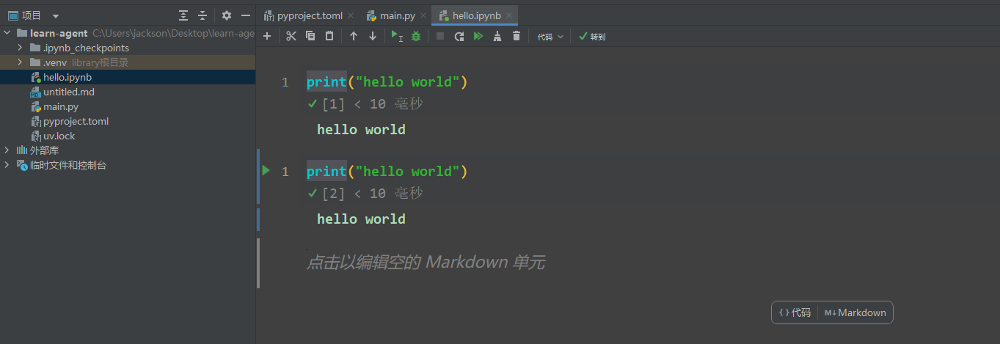
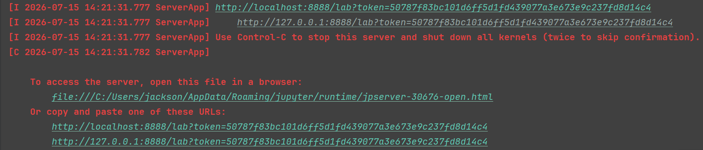
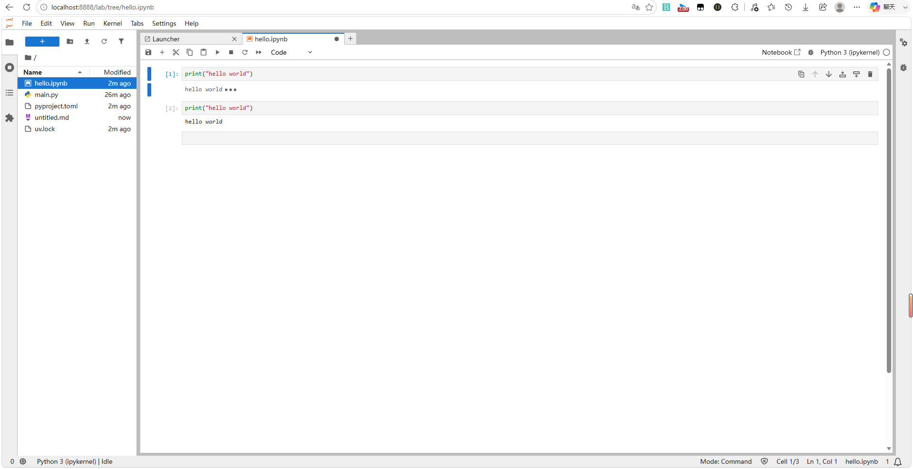

<h1 style="text-align: center;">Jupyter Notebook</h1>

## 安装 notebook

```bash
pip install notebook
```

## 启动运行

> #### 新建一个 notebook 文件，支持编写代码和 markdown，首次运行会有点慢

<br/>


> #### 在控制台的日志中会展示服务启动端口，打开后如下


<br/>

