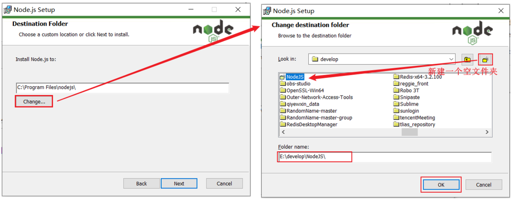
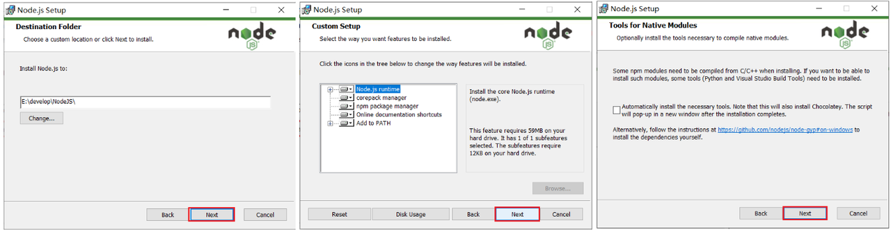

<h1 style="text-align: center;">Node.js 安装及配置</h1>

---

> <h3>官网：<a href="https://nodejs.org/en">https://nodejs.org/en</a></h3>

## 安装

#### （1）双击安装包

<br/>


#### （2）选择安装到一个，没有中文，没有空格 的目录下（新建一个文件夹 NodeJS）

<br/>


#### （3）点击 Next，下一步下一步的安装即可

<br/>


#### （4）验证 NodeJS 的环境变量

> #### NodeJS 安装完毕后，会自动配置好环境变量，我们验证一下是否安装成功，打开 cmd，执行命令 <span style="color:red;">node -v</span>

<br/>


#### （5） 配置 npm 的全局安装路径

> #### 使用<span style="color:red;">管理员身份</span>运行命令行，在命令行中，执行如下指令
>
> #### <span style="color:red;">路径需要指定为 Nodejs 的安装目录</span>

```bash
npm config set prefix "D:\develop\NodeJS"
```

#### （6）切换为淘宝镜像，加速下载

```bash
npm config set registry https://registry.npmmirror.com
```
