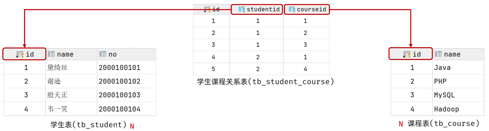
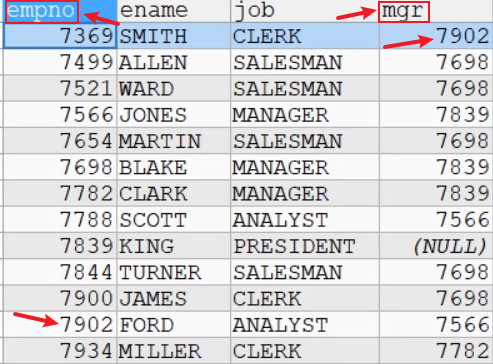

<h1 style="text-align: center;">多表查询</h1>
 
- - -

## 基本介绍

### 问题引出

> #### 当寻需要查询的信息分布在不同的表上时，我们就需要用到多表查询

### 多表查询

> #### 多表查询是指基于<span style = "color:red;font-weight:bold">两个和两个以上</span>的表查询。在实际应用中，查询单个表可能无法满足需求

## 笛卡尔积


```bash
SELECT * FROM table1,table2
```

> <h4>在默认情况下：当两个表查询时，规则如下</h4>
>
> - <h4>从第一张表中，<span style = "color:red;font-weight:bold">取出一行和第二张表的每一行进行组合</span>，返回结果（含有两张表的所有列）</h4>
> - <h4><span style = "color:red;font-weight:bold">一共返回的记录数 = 第一张表行数 * 第二张表的行数</span></h4>
> - <h4>这样多表查询默认处理返回的结果，称为<span style = "color:red;font-weight:bold">笛卡尔积</span></h4>
> - <h4>解决这个多表的关键就是要<span style = "color:red;font-weight:bold">写出正确的过滤条件 where</span>, 需要程序员进行分析</h4>

## 基本使用

### 基本介绍

> #### 需要调用<span style = "color:red;font-weight:bold">某张表的字段</span>，语法：<span style = "color:red;font-weight:bold">表名</span> <span style = "color:red;font-weight:bold;font-size:30px">.</span> <span style = "color:red;font-weight:bold">字段</span>
>
> #### 整体思路：由易到难，逐步拆分，先写一个简单的 sql，然后加入过滤条件
>
> #### ⭐ 特点：多表查询再 SQL 语句中会在<span style = "color:red">过滤条件</span>中<span style = "color:red">建立两表的联查关系</span>，目的是为了<span style = "color:red">去除笛卡尔积</span>

### ⚠️ 注意点

> - <h4>多表查询的条件<span style = "color:red;font-weight:bold">不能少于表的个数 - 1</span>， <span style = "color:red;font-weight:bold">否则会出现笛卡尔积</span></h4>
> - <h4>当<span style = "color:red;font-weight:bold">不同表的字段名同名</span>时，需要明确字段属于哪一张表（语法：<span style = "color:red;font-weight:bold">表名</span> <span style = "color:red;font-weight:bold;font-size:30px">.</span> <span style = "color:red;font-weight:bold">字段</span>），否则会出现语法错误</h4>

### 应用案例

> #### 显示部门号为 10 的部门名、员工名，工资

#### （1）分析所需表

> #### emp 表：雇员名、雇员工资
>
> #### dept 表：部门的名字

#### （2） 首先我们可以显示雇员名、雇员工资及所在的部门名字

```bash
SELECT ename,sal,dname,emp.deptno
FROM emp, dept
WHERE emp.deptno = dept.deptno
```

#### （3） 加上过滤条件，只显示部门号为 10 的部门名

```bash
SELECT ename,sal,dname,emp.deptno
FROM emp, dept
WHERE emp.deptno = dept.deptno AND emp.deptno = 10
```

## ⭐ 多表关系

### 一对多

#### （1）场景

> #### 部门与员工的关系（一个部门下有多个员工）

#### （2）多表关系

> #### 由于一个部门下，会关联多个员工。 而一个员工，是归属于某一个部门的 。那么此时，我们就需要在 emp 表中增加一个字段 dept_id 来标识这个员工属于哪一个部门，dept_id 关联的是 dept 的 id

#### （3）一对多的表关系，在数据库层面该如何实现？

> #### 在数据库表中<span style="color:red">多的一方，添加字段</span>，来关联一的一方的主键

### 一对一

#### （1）基本介绍

> #### 一对一关系表在实际开发中应用起来比较简单，通常是用来做单表的拆分，也就是将一张大表拆分成两张小表，将大表中的一些基础字段放在一张表当中，将其他的字段放在另外一张表当中，以此来提高数据的操作效率

#### （2）实际应用

> #### 如果在业务系统当中，对用户的基本信息查询频率特别的高，但是对于用户的身份信息查询频率很低，此时出于提高查询效率的考虑，我就可以将这张<span style = "color:red">大表拆分成两张小表</span>
>
> #### 第一张表存放的是用户的基本信息，而第二张表存放的就是用户的身份信息
>
> #### 他们两者之间一对一的关系，一个用户只能对应一个身份证，而一个身份证也只能关联一个用户

#### （3）那么在数据库层面怎么去体现上述两者之间是一对一的关系呢？

> #### 其实<span style = "color:red">一对一</span>我们可以看成一种<span style = "color:red">特殊的一对多</span>
>
> #### 一对多我们是怎么设计表关系的？
>
> #### 在任意一方加入<span style = "color:red">外键</span>，<span style = "color:red">关联</span>另外一方的<span style = "color:red">主键</span>，并且设置<span style = "color:red">外键</span>为<span style = "color:red">唯一</span>的（UNIQUE）

### 多对多

#### （1）场景：学生与课程的关系

> #### 关系：一个学生可以选修多门课程，一门课程也可以供多个学生选择

#### （2）⭐ 常见处理方法

> #### <span style = "color:red">建立第三张中间表，中间表至少包含两个外键，分别关联两方主键</span>



## 自连接（内连接）

### ⭐ 表间关系


> <h3>自连接（内连接）：相当于查询 <span style="color:red">A、B 交集部分</span>数据</h3>

### 基本介绍

> #### 自连接是指在同一张表的连接查询，将<span style = "color:red;font-weight:bold">同一张表看作两张表</span>，需要明确字段属于哪一张表（语法：<span style = "color:red;font-weight:bold">表名</span> <span style = "color:red;font-weight:bold;font-size:30px">.</span> <span style = "color:red;font-weight:bold">字段</span>），否则会出现语法错误

### 隐式内连接语法

```sql
select 字段列表 from 表 1 , 表 2 where 条件 ... ;
```

### 显式内连接语法

```sql
select 字段列表 from 表 1 [ inner ] join 表 2 on 连接条件 ... ;
```

### 给表起别名简化写法

```sql
select  字段列表 from 表1 as 别名1 , 表2 as  别名2  where  条件 ... ;

select  字段列表 from 表1 别名1 , 表2  别名2  where  条件 ... ;  -- as 可以省略
```

### ⚠️ 注意点

> - <h4>将<span style = "color:red;font-weight:bold">同一张表看作两张表</span>，需要<span style = "color:red;font-weight:bold">起别名</span>，避免冲突导致语法报错</h4>
> - <h4>起别名语法：FROM <span style = "color:red;font-weight:bold">原表名 别名1，原表名 别名2...</span></h4>
> - <h4><span style = "color:red;font-weight:bold">列名</span>不明确，需要<span style = "color:red;font-weight:bold">起别名</span></h4>

### 应用案例



#### 显示公司员工和上级的的名字

> #### （1）员工名字 在 emp，上级的名字在 emp
>
> #### （2）员工和上级是通过 emp 表的 mgr 列关联

```bash
SELECT worker.ename AS '职员名', boss.ename AS '上级名'
FROM emp worker, emp boss # 起别名
WHERE worker.mgr = boss.empno; # 关系式
```

## 外连接

### 需求引入

> #### 之前在做查询的时候，我们使用的是两个表的记录做匹配的方法实现查询想要的结果，现在有新的需求，<span style = "color:red;font-weight:bold">显示两表中字段没有匹配的记录</span>，这个时候就需要用到外连接了

### ⭐ 表间关系


> #### 左外连接：查询左表所有数据（包括两张表交集部分数据）
>
> #### 右外连接：查询右表所有数据（包括两张表交集部分数据）

### 左外连接

> <h4>语法：<span style = "color:red;font-weight:bold">SELECT ... FROM 左表 <span style = "color:blue;font-weight:bold">LEFT JOIN</span> 右表 <span style = "color:blue;font-weight:bold"LEFT JOIN> ON </span> 限制条件 </span></h4>

```bash
SELECT dname, ename, job
FROM dept LEFT JOIN emp
ON dept.deptno = emp.deptno

```

### 右外连接

> <h4>语法：<span style = "color:red;font-weight:bold">SELECT ... FROM 左表 <span style = "color:blue;font-weight:bold">RIGHT JOIN</span> 右表 <span style = "color:blue;font-weight:bold"LEFT JOIN> ON </span> 限制条件 </span></h4>

```bash
SELECT dname, ename, job
FROM emp RIGHT JOIN dept
ON dept.deptno = emp.deptno
```

### ⚠️ 注意点

> #### <span style="color:red">左</span>外连接和<span style="color:red">右</span>外连接是<span style="color:red">可以相互替换</span>的，只需要<span style="color:red">调整</span>连接查询时 SQL 语句中<span style="color:red">表的先后顺序</span>就可以了
>
> #### 我们在日常开发使用时，<span style="color:red">更偏向于左外连接</span>

## 子查询

### 基本介绍

> #### 子查询是指嵌入在其它 sql 语句中的 select 语句，也叫<span style = "color:red;font-weight:bold">嵌套查询</span>

### 子查询语句编写技巧

> #### 先对需求做拆分，明确具体的步骤，然后再逐条编写 SQL 语句。 最终将多条 SQL 语句合并为一条

### 子查询语句位置

> #### （1）where 之后
>
> #### （2）from 之后
>
> #### （3）select 之后

### 子查询分类

> #### <span style = "color:red">标量</span>子查询（子查询结果为<span style = "color:red">单个值</span>，一行一列）
>
> #### <span style = "color:red">列</span>子查询（子查询结果为<span style = "color:red">一列</span>，但可以是多行）
>
> #### <span style = "color:red">行</span>子查询（子查询结果为<span style = "color:red">一行</span>，但可以是多列）
>
> #### <span style = "color:red">表</span>子查询（子查询结果为<span style = "color:red">多行多列</span>相当于子查询结果是一张表）

### 单行子查询

> #### 单行子查询是指<span style = "color:red;font-weight:bold">只返回一行数据</span>的子查询语句

<h3>案例：如何显示与 SMITH 同一部门的所有员工？</h3>

#### （1）首先需要知道 SMITH 的部门编号

```bash
SELECT deptno
FROM emp
WHERE ename = 'SMITH'
```

#### （2）然后通过部门编号查询

```bash
SELECT *
FROM emp
WHERE deptno = (
    SELECT deptno
    FROM emp
    WHERE ename = 'SMITH'
);
```

### 多行子查询

> #### 多行子查询指<span style = "color:red;font-weight:bold">返回多行数据</span>的子查询 使用<span style = "color:red;font-weight:bold">关键字 in</span>

<h3>案例：如何查询和 10 号部门中工作岗位（可以有多个）相同的雇员的名字、岗位、工资、部门号，但是不含 10 号部门的雇员</h3>

#### （1）首先查询 10 号部门有哪些工作岗位

```bash
SELECT DISTINCT job
FROM emp
WHERE deptno = 10;
```

#### （2）使用<span style = "color:red;font-weight:bold">关键字 in</span>，利用子查询结果，同时增加过滤条件

```bash
SELECT ename, job, sal, deptno
FROM emp
WHERE job IN (
    SELECT DISTINCT job
    FROM emp
    WHERE deptno = 10
) AND deptno <> 10;
```

### 多列子查询

> #### 语法：<span style = "color:red;font-weight:bold">(字段 1,字段 2...) = (SELECT 字段 1,字段 2 FROM...)</span>

#### 案例：查询和宋江数学，英语，语文完全相同的学生

```bash
SELECT *
FROM student
WHERE (math, english, chinese) = (
    SELECT math, english, chinese
    FROM student
    WHERE `name` = '宋江'
)
```

### ⭐ 子查询结果做临时表

<h3>案例：查询 ecshop 表，各个类别中价格最高的商品</h3>

> <h3> 要求显示字段：goods_id、cat_id、goods_name、shop_price</h3>

#### 思路拆解：（1）按要求查询字段

```bash
SELECT goods_id、cat_id、goods_name、shop_price
FROM ecs_goods;
```

#### 思路拆解：（2）按要求分组查询，并显示价格最高的商品

```bash
SELECT cat_id , MAX(shop_price)
FROM ecs_goods
GROUP BY cat_id
```

#### ⭐ 思路拆解：（3）合并两张表，子查询结果当作临时表使用

> #### 使用子表查询结果作为<span style = "color:red;font-weight:bold">临时表</span>使用，在已经知道各个类别中价格最高的商品（子表查询结果做临时表）的前提下<span style = "color:red;font-weight:bold">依据商品 id 匹配</span>，输出要求查询的信息

```bash
SELECT goods_id、cat_id、goods_name、shop_price
FROM (  SELECT cat_id , MAX(shop_price)
        FROM ecs_goods
        GROUP BY cat_id
     ) temp , ecs_goods
WHERE temp.cat_id = ecs_good.cat_id
AND temp.max_price = ecs_goods.shop_price
```

### ALL

#### 案例：显示工资比部门 30 的<span style = "color:red;font-weight:bold">所有</span>员工的工资高的员工的姓名、工资和部门号

```bash
SELECT ename, sal, deptno
FROM emp
WHERE sal > ALL(
    SELECT sal
    FROM emp
    WHERE deptno = 30
)
```

#### 等价写法

```bash
SELECT ename, sal, deptno
FROM emp
WHERE sal > (
    SELECT MAX(sal)
    FROM emp
    WHERE deptno = 30
)
```

### ANY

#### 案例：显示工资比部门 30 的<span style = "color:red;font-weight:bold">其中一个</span>员工的工资高的员工的姓名、工资和部门号

```bash
SELECT ename, sal, deptno
FROM emp
WHERE sal > any(
    SELECT sal
    FROM emp
    WHERE deptno = 30
)
```

#### 等价写法

```bash
SELECT ename, sal, deptno
FROM emp
WHERE sal > (
    SELECT min(sal)
    FROM emp
    WHERE deptno = 30
);
```
