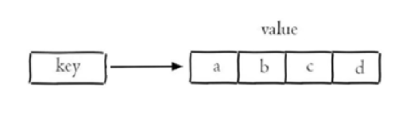
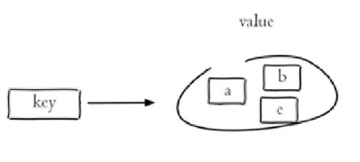
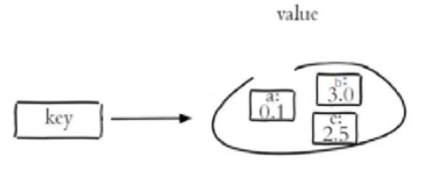

<h1 style="text-align: center;">Redis 常用命令</h1>
 
- - -

## 字符串操作命令

- <h4>SET key value ：设置指定 key 的值</h4>
- <h4>GET key ：获取指定 key 的值</h4>
- <h4>SETEX key seconds value ：设置指定 key 的值，并将 key 的过期时间设为 seconds 秒</h4>
- <h4>SETNX key value ：只有在 key 不存在时设置 key 的值</h4>

> #### 更多命令可以参考 Redis 中文网：https://www.redis.net.cn

## 哈希操作命令

> #### Redis hash 是一个 string 类型的 field 和 value 的映射表，hash 特别适合用于存储对象

- <h4>HSET key field value：将哈希表 key 中的字段 field 的值设为 value</h4>
- <h4>HGET key field：获取存储在哈希表中指定字段的值</h4>
- <h4>HDEL key field：删除存储在哈希表中的指定字段</h4>
- <h4>HKEYS key：获取哈希表中所有字段</h4>
- <h4>HVALS key：获取哈希表中所有值</h4>

## 列表操作命令

> #### Redis 列表是简单的字符串列表，按照插入顺序排序

- <h4>LPUSH key value1 [value2]：将一个或多个值插入到列表头部</h4>
- <h4>LRANGE key start stop：获取列表指定范围内的元素</h4>
- <h4>RPOP key：移除并获取列表最后一个元素</h4>
- <h4>LLEN key：获取列表长度</h4>
- <h4>BRPOP key1 [key2 ] timeout：移出并获取列表的最后一个元素， 如果列表没有元素会阻塞列表直到等待超    时或发现可弹出元素为止</h4>

## 集合操作命令

> #### Redis set 是 string 类型的无序集合。集合成员是唯一的，这就意味着集合中不能出现重复的数据

- <h4>SADD key member1 [member2] ：向集合添加一个或多个成员</h4>
- <h4>SMEMBERS key ：返回集合中的所有成员</h4>
- <h4>SCARD key ：获取集合的成员数</h4>
- <h4>SINTER key1 [key2] ：返回给定所有集合的交集</h4>
- <h4>SUNION key1 [key2] ：返回所有给定集合的并集</h4>
- <h4>SREM key member1 [member2] ：移除集合中一个或多个成员</h4>

## 有序集合操作命令

> #### Redis 有序集合是 string 类型元素的集合，且不允许有重复成员。每个元素都会关联一个 double 类型的分数

- <h4>ZADD key score1 member1 [score2 member2] ：向有序集合添加一个或多个成员</h4>
- <h4>ZRANGE key start stop [WITHSCORES] ：通过索引区间返回有序集合中指定区间内的成员</h4>
- <h4>ZINCRBY key increment member ：有序集合中对指定成员的分数加上增量 increment</h4>
- <h4>ZREM key member [member ...] ：移除有序集合中的一个或多个成员</h4>

## 通用命令

> #### Redis 的通用命令是不分数据类型的，都可以使用的命令

- <h4>KEYS pattern ：查找所有符合给定模式( pattern)的 key</h4>
- <h4>EXISTS key ：检查给定 key 是否存在</h4>
- <h4>TYPE key ：返回 key 所储存的值的类型</h4>
- <h4>DEL key ：该命令用于在 key 存在是删除 key</h4>
