<h1 style="text-align: center;">秒杀问题</h1>

---

## 全局 ID 生成器

### 基本介绍


> #### 符号位：1 bit，永远为 0
>
> ####
>
> #### 时间戳：31 bit，以秒为单位，可以使用 69 年
>
> ####
>
> #### 序列号：32 bit，秒内的计数器，支持每秒产生 2<sup>32</sup> 个不同 ID

### 计算开始时间

```java
public static void main(String[] args) {
    LocalDateTime time = LocalDateTime.of(
        year: 2022,
        month: 1,
        dayOfMonth: 1,
        hour: 0,
        minute: 0,
        second: 0
    );
    long second = time.toEpochSecond(ZoneOffset.UTC);
    System.out.println("second = " + second);
}
```

### 代码实现

```java
@Component
public class RedisIdWorker {
    /**
     * 开始时间戳
     */
    private static final long BEGIN_TIMESTAMP = 1640995200L;
    /**
     * 序列号的位数
     */
    private static final int COUNT_BITS = 32;

    private StringRedisTemplate stringRedisTemplate;

    public RedisIdWorker(StringRedisTemplate stringRedisTemplate) {
        this.stringRedisTemplate = stringRedisTemplate;
    }

    public long nextId(String keyPrefix) {
        // 1.生成时间戳
        LocalDateTime now = LocalDateTime.now();
        long nowSecond = now.toEpochSecond(ZoneOffset.UTC);
        long timestamp = nowSecond - BEGIN_TIMESTAMP;

        // 2.生成序列号
        // 2.1.获取当前日期，精确到天
        String date = now.format(DateTimeFormatter.ofPattern("yyyy:MM:dd"));
        // 2.2.自增长
        long count = stringRedisTemplate
                        .opsForValue()
                        .increment("icr:" + keyPrefix + ":" + date);

        // 3.拼接并返回
        return timestamp << COUNT_BITS | count;
    }
}
```

## 秒杀下单

### 基本思路

<br/>


```java
@Override
public Result seckillVoucher(Long voucherId) {
    // 1.查询优惠券
    SeckillVoucher voucher = seckillVoucherService.getById(voucherId);
    // 2.判断秒杀是否开始
    if (voucher.getBeginTime().isAfter(LocalDateTime.now())) {
        // 尚未开始
        return Result.fail("秒杀尚未开始！");
    }
    // 3.判断秒杀是否已经结束
    if (voucher.getEndTime().isBefore(LocalDateTime.now())) {
        // 尚未开始
        return Result.fail("秒杀已经结束！");
    }
    // 4.判断库存是否充足
    if (voucher.getStock() < 1) {
        // 库存不足
        return Result.fail("库存不足！");
    }
    //5，扣减库存
    boolean success = seckillVoucherService.update()
            .setSql("stock= stock -1")
            .eq("voucher_id", voucherId).update();
    if (!success) {
        //扣减库存
        return Result.fail("库存不足！");
    }
    //6.创建订单
    VoucherOrder voucherOrder = new VoucherOrder();
    // 6.1.订单id
    long orderId = redisIdWorker.nextId("order");
    voucherOrder.setId(orderId);
    // 6.2.用户id
    Long userId = UserHolder.getUser().getId();
    voucherOrder.setUserId(userId);
    // 6.3.代金券id
    voucherOrder.setVoucherId(voucherId);
    save(voucherOrder);

    return Result.ok(orderId);

}
```

### 超卖问题

<br/>
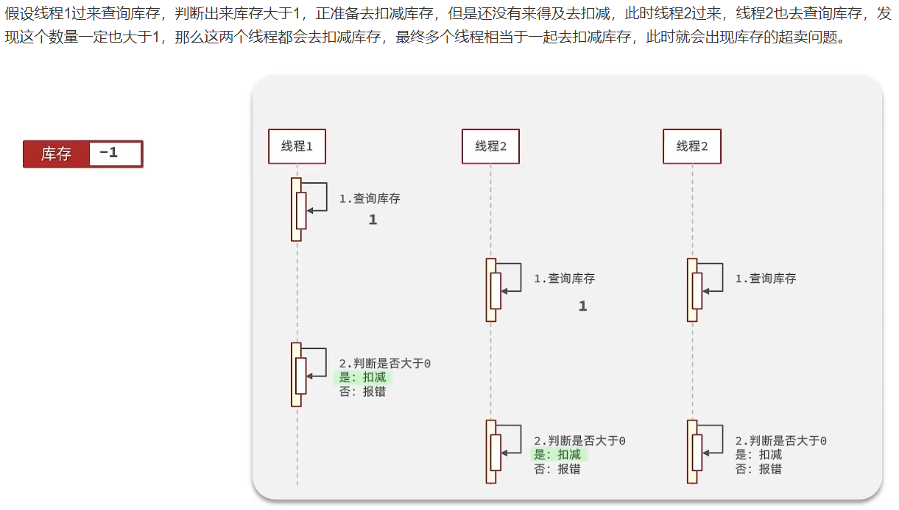

### 乐观锁

#### （1）锁类型介绍

> #### 悲观锁：可以实现对于数据的串行化执行，比如 syn，和 lock 都是悲观锁的代表，同时，悲观锁中又可以再细分为公平锁，非公平锁，可重入锁，等等

<br/>
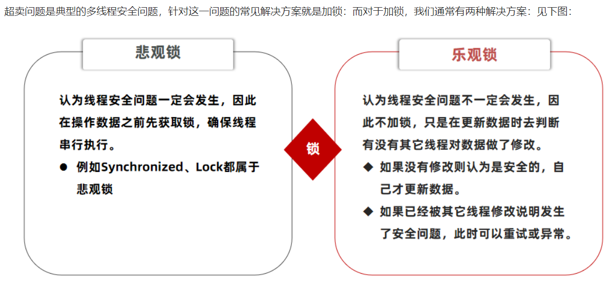

#### （2）乐观锁的两种实现

> #### CAS 法：在扣减库存的时候查询当前库存是否存在，如果存在，则说明没有其他线程操作过
>
> #### 版本号法：增加 version 属性，具体如下图

<br/>
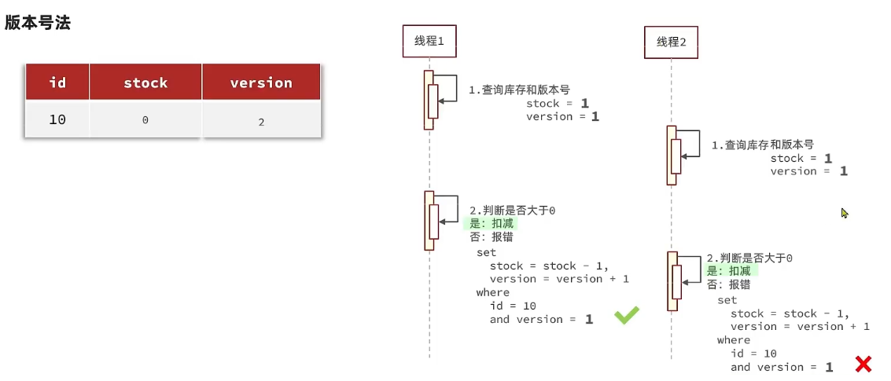

#### 乐观锁解决超卖：方案一

> #### 以下逻辑的核心含义是：只要我扣减库存时的库存和之前我查询到的库存是一样的，就意味着没有人在中间修改过库存，那么此时就是安全的，但是以上这种方式通过测试发现会有很多失败的情况，失败的原因在于：在使用乐观锁过程中假设 100 个线程同时都拿到了 100 的库存，然后大家一起去进行扣减，但是 100 个人中只有 1 个人能扣减成功，其他的人在处理时，他们在扣减时，库存已经被修改过了，所以此时其他线程都会失败

```java
boolean success = seckillVoucherService.update()
                .setSql("stock= stock -1") //set stock = stock -1
                .eq("voucher_id", voucherId)
                .eq("stock",voucher.getStock()).update(); //where id = ？ and stock = ?
```

#### 乐观锁解决超卖：方案二

> #### 之前的方式要修改前后都保持一致，但是这样我们分析过，成功的概率太低，所以我们的乐观锁需要变一下，改成 stock 大于 0 即可

```java
boolean success = seckillVoucherService.update()
                .setSql("stock= stock -1")
                .eq("voucher_id", voucherId)
                .update()
                .gt("stock",0); //where id = ? and stock > 0
```

### 一人一单

<br/>
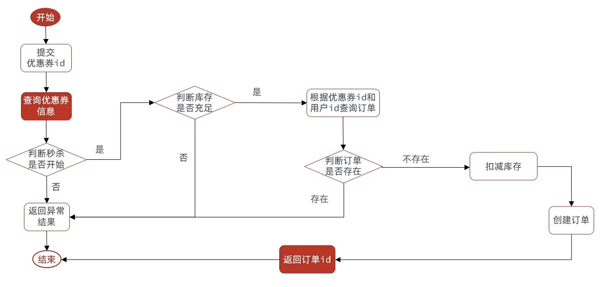

> #### 存在问题：现在的问题还是和之前一样，并发过来，查询数据库，都不存在订单，所以我们还是需要加锁，但是乐观锁比较适合更新数据，而现在是插入数据，所以我们需要使用悲观锁操作

```java
@Service
public class VoucherOrderServiceImpl extends ServiceImpl<VoucherOrderMapper, VoucherOrder> implements IVoucherOrderService {

    @Resource
    private ISeckillVoucherService seckillVoucherService;

    @Resource
    private RedisIdWorker redisIdWorker;

    @Resource
    private StringRedisTemplate stringRedisTemplate;

    @Override
    public Result seckillVoucher(Long voucherId) {
        // 1. 查询优惠券
        SeckillVoucher voucher = seckillVoucherService.getById(voucherId);
        // 2. 判断秒杀是否开始
        if (voucher.getBeginTime().isAfter(LocalDateTime.now())) {
            // 尚未开始
            return Result.fail("秒杀尚未开始！");
        }
        // 3. 判断秒杀是否已经结束
        if (voucher.getEndTime().isBefore(LocalDateTime.now())) {
            // 尚未开始
            return Result.fail("秒杀已经结束！");
        }
        // 4. 判断库存是否充足
        if (voucher.getStock() < 1) {
            // 库存不足
            return Result.fail("库存不足！");
        }

       Long userId = UserHolder.getUser().getId();
       /*
        * 1. 当前方法被spring的事务控制，如果你在方法内部加锁，可能会导致当前方法事务还没有提交，
        * 但是锁已经释放也会导致问题，所以我们选择将当前方法整体包裹起来，确保事务不会出现问题
        *
        * 2. 事务想要生效，还得利用代理来生效，所以这个地方，我们需要获得原始的事务对象来操作事务
        *
        * 3. intern() 这个方法是从常量池中拿到数据，如果我们直接使用 userId.toString()
        * 他拿到的对象实际上是不同的对象，new 出来的对象，我们使用锁必须保证锁必须是同一把，
        * 所以我们需要使用 intern() 方法
        */
       synchronized (userId.toString().intern()) {
           IVoucherOrderService proxy = (IVoucherOrderService) AopContext.currentProxy();
           return proxy.createVoucherOrder(voucherId);
       }
    }

    @Transactional
    public Result createVoucherOrder(Long voucherId) {
        // 一人一单
        Long userId = UserHolder.getUser().getId();
        int count = query()
                .eq("user_id", userId)
                .eq("voucher_id", voucherId)
                .count();
        if (count > 0) {
            return Result.fail("用户已经购买过一次！");
        }

        // 5. 扣减库存
        boolean success = seckillVoucherService.update()
                .setSql("stock = stock - 1")
                .eq("voucher_id", voucherId)
                // 乐观锁解决在多线程下的超卖问题
                .gt("stock", 0)
                .update();
        if (!success) {
            // 扣减失败
            return Result.fail("库存不足！");
        }
        // 6. 创建订单
        VoucherOrder voucherOrder = new VoucherOrder();
        // 6.1. 订单id
        long orderId = redisIdWorker.nextId("order");
        voucherOrder.setId(orderId);
        // 6.2. 用户id
        voucherOrder.setUserId(userId);
        // 6.3. 代金券id
        voucherOrder.setVoucherId(voucherId);
        save(voucherOrder);
        // 7. 返回订单id
        return Result.ok(orderId);
    }
}
```

## 分布式锁

### 集群环境下锁失效

> #### 由于现在我们部署了多个 tomcat，每个 tomcat 都有一个属于自己的 jvm，那么假设在服务器 A 的 tomcat 内部，有两个线程，这两个线程由于使用的是同一份代码，那么他们的锁对象是同一个，是可以实现互斥的，但是如果现在是服务器 B 的 tomcat 内部，又有两个线程，但是他们的锁对象写的虽然和服务器 A 一样，但是锁对象却不是同一个，所以线程 3 和线程 4 可以实现互斥，但是却无法和线程 1 和线程 2 实现互斥，这就是集群环境下， syn 锁失效的原因，在这种情况下，我们就需要使用分布式锁来解决这个问题

<br/>
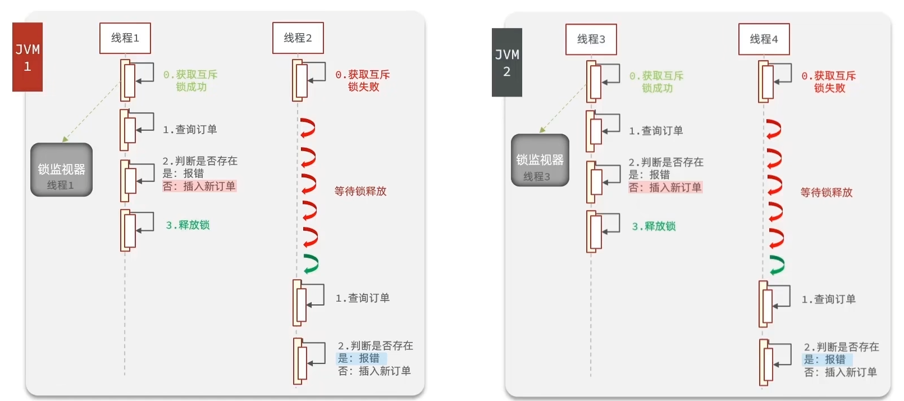

### 实现原理

> #### 分布式锁：满足分布式系统或集群模式下多进程可见并且互斥的锁

> #### 核心思想：让大家都使用同一把锁，只要大家使用的是同一把锁，那么我们就能锁住线程，不让线程进行，让程序串行执行

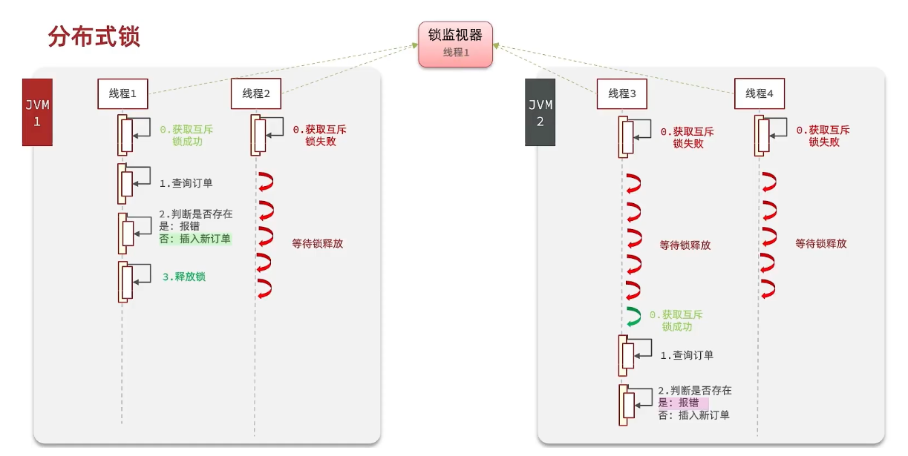

> #### 分布式锁需要满足的条件
>
> #### （1）可见性：多个线程都能看到相同的结果，注意：这个地方说的可见性并不是并发编程中指的内存可见性，只是说多个进程之间都能感知到变化的意思
>
> #### （2）互斥：互斥是分布式锁的最基本的条件，使得程序串行执行
>
> #### （3）高可用：程序不易崩溃，时时刻刻都保证较高的可用性
>
> #### （4）高性能：由于加锁本身就让性能降低，所有对于分布式锁本身需要他就较高的加锁性能和释放锁性能
>
> #### （5）安全性：安全也是程序中必不可少的一环

### 实现方式

<br/>
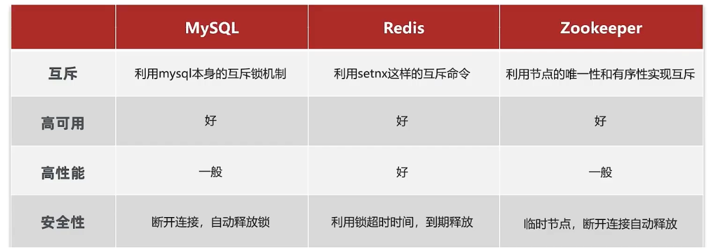

> #### Mysql：mysql 本身就带有锁机制，但是由于 mysql 性能本身一般，所以采用分布式锁的情况下，其实使用 mysql 作为分布式锁比较少见
>
> #### Redis：redis 作为分布式锁是非常常见的一种使用方式，现在企业级开发中基本都使用 redis 或者 zookeeper 作为分布式锁，利用 setnx 这个方法，如果插入 key 成功，则表示获得到了锁，如果有人插入成功，其他人插入失败则表示无法获得到锁，利用这套逻辑来实现分布式锁
>
> #### Zookeeper：zookeeper 也是企业级开发中较好的一个实现分布式锁的方案，由于本套视频并不讲解 zookeeper 的原理和分布式锁的实现，所以不过多阐述

### Redis 实现

#### （1）定义接口

```java
public interface ILock {

    /**
     * 尝试获取锁
     * @param timeoutSec 锁持有的超时时间，过期后自动释放
     * @return true 代表获取锁成功；false 代表获取锁失败
     */
    boolean tryLock(Long timeoutSec);

    /**
     * 释放锁
     */
    void unLock();
}
```

#### （2）编写实现类

```java
public class SimpleRedisLock implements ILock {

    private String name;

    private StringRedisTemplate stringRedisTemplate;

    public SimpleRedisLock(String name, StringRedisTemplate stringRedisTemplate) {
        this.name = name;
        this.stringRedisTemplate = stringRedisTemplate;
    }

    public static final String KEY_PREFIX = "lock:";

    @Override
    public boolean tryLock(long timeoutSec) {
        // 获取线程标示
        String threadId = Thread.currentThread().getId()
        // 获取锁
        Boolean success = stringRedisTemplate.opsForValue()
                .setIfAbsent(KEY_PREFIX + name, threadId + "", timeoutSec, TimeUnit.SECONDS);
        return Boolean.TRUE.equals(success);
    }

    @Override
    public void unlock() {
        //通过del删除锁
        stringRedisTemplate.delete(KEY_PREFIX + name);
    }
}
```

#### （3）修改业务代码

```java
@Override
public Result seckillVoucher(Long voucherId) {
    // 1. 查询优惠券
    SeckillVoucher voucher = seckillVoucherService.getById(voucherId);
    // 2. 判断秒杀是否开始
    if (voucher.getBeginTime().isAfter(LocalDateTime.now())) {
        // 尚未开始
        return Result.fail("秒杀尚未开始！");
    }
    // 3. 判断秒杀是否已经结束
    if (voucher.getEndTime().isBefore(LocalDateTime.now())) {
        // 尚未开始
        return Result.fail("秒杀已经结束！");
    }
    // 4. 判断库存是否充足
    if (voucher.getStock() < 1) {
        // 库存不足
        return Result.fail("库存不足！");
    }

    Long userId = UserHolder.getUser().getId();

    // 创建锁对象
    SimpleRedisLock lock = new SimpleRedisLock("order:" + userId, stringRedisTemplate);
    // 获取锁
    boolean isLock = lock.tryLock(1200L);
    // 判断是否获取锁成功
    if (!isLock){
        return Result.fail("不允许重复下单");
    }
    try {
        // 获取代理对象（事务）
        IVoucherOrderService proxy = (IVoucherOrderService) AopContext.currentProxy();
        return proxy.createVoucherOrder(voucherId);
    } finally {
        // 释放锁
        lock.unLock();
    }
}
```

### 锁误删问题

#### （1）问题描述

> #### 持有锁的线程在锁的内部出现了阻塞，导致他的锁自动释放，这时其他线程，线程 2 来尝试获得锁，就拿到了这把锁，然后线程 2 在持有锁执行过程中，线程 1 反应过来，继续执行，而线程 1 执行过程中，走到了删除锁逻辑，此时就会把本应该属于线程 2 的锁进行删除，这就是误删别人锁的情况说明

#### （2）解决方案

> #### 在每个线程释放锁的时候，去判断一下当前这把锁是否属于自己，如果属于自己，则不进行锁的删除，假设还是上边的情况，线程 1 卡顿，锁自动释放，线程2进入到锁的内部执行逻辑，此时线程 1 反应过来，然后删除锁，但是线程 1，一看当前这把锁不是属于自己，于是不进行删除锁逻辑，当线程 2 走到删除锁逻辑时，如果没有卡过自动释放锁的时间点，则判断当前这把锁是属于自己的，于是删除这把锁
>
> #### 核心逻辑：在存入锁时，放入自己线程的标识，在删除锁时，判断当前这把锁的标识是不是自己存入的，如果是，则进行删除，如果不是，则不进行删除

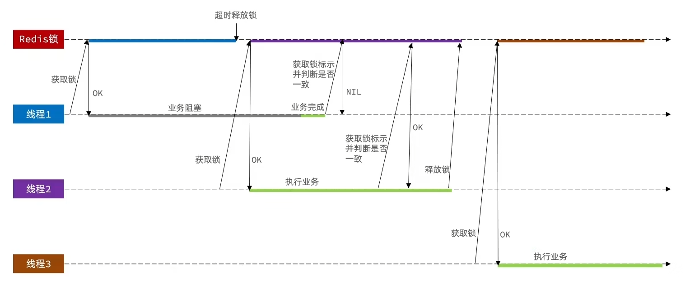

#### （3）代码改造

```java
private String name;

private StringRedisTemplate stringRedisTemplate;

public SimpleRedisLock(String name, StringRedisTemplate stringRedisTemplate) {
    this.name = name;
    this.stringRedisTemplate = stringRedisTemplate;
}

public static final String KEY_PREFIX = "lock:";

// true 可以取消随机字符串间的横杠
public static final String ID_PRIFIX = UUID.randomUUID().toString(true) + "-";

@Override
public boolean tryLock(long timeoutSec) {
   // 获取线程标示
   String threadId = ID_PREFIX + Thread.currentThread().getId();
   // 获取锁
   Boolean success = stringRedisTemplate.opsForValue()
                .setIfAbsent(KEY_PREFIX + name, threadId, timeoutSec, TimeUnit.SECONDS);
   return Boolean.TRUE.equals(success);
}

public void unlock() {
    // 获取线程标示
    String threadId = ID_PREFIX + Thread.currentThread().getId();
    // 获取锁中的标示
    String id = stringRedisTemplate.opsForValue().get(KEY_PREFIX + name);
    // 判断标示是否一致
    if(threadId.equals(id)) {
        // 释放锁
        stringRedisTemplate.delete(KEY_PREFIX + name);
    }
}
```

### 原子性问题

> #### 更为极端的误删逻辑说明：线程 1 现在持有锁之后，在执行业务逻辑过程中，他正准备删除锁，而且已经走到了条件判断的过程中，比如他已经拿到了当前这把锁确实是属于他自己的，正准备删除锁，但是此时他的锁到期了，那么此时线程 2 进来，但是线程 1 他会接着往后执行，当他卡顿结束后，他直接就会执行删除锁那行代码，相当于条件判断并没有起到作用，这就是删锁时的原子性问题，之所以有这个问题，是因为线程 1 的拿锁，比锁，删锁，实际上并不是原子性的，我们要防止刚才的情况发生

<br/>
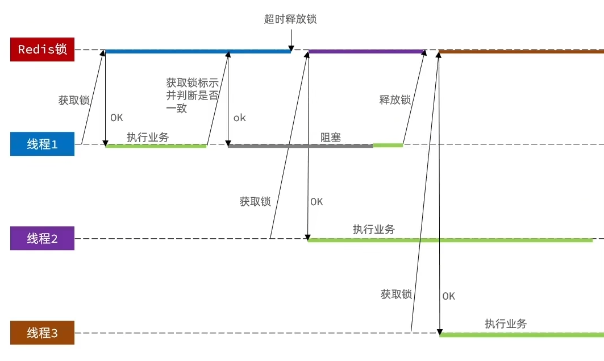

### lua 脚本解决原子性问题

#### （1）lua 脚本基本介绍

> #### 基本语法参考网站：https://www.runoob.com/lua/lua-tutorial.html，
>
> #### Redis提供了 Lua 脚本功能，在一个脚本中编写多条 Redis 命令，确保多条命令执行时的原子性
>
> #### Lua 是一种编程语言，这里重点介绍 Redis 提供的调用函数，我们可以使用 lua 去操作 redis，又能保证他的原子性，这样就可以实现拿锁比锁删锁是一个原子性动作了，作为 Java 程序员这一块并不需要大家过于精通，只需要知道他有什么作用即可

#### 这里重点介绍Redis提供的调用函数，语法如下

```lua
redis.call('命令名称', 'key', '其它参数', ...)
```

#### 例如，我们要执行set name jack，则脚本是这样

```lua
# 执行 set name jack
redis.call('set', 'name', 'jack')
```

#### 例如，我们要先执行set name Rose，再执行get name，则脚本如下

```lua
# 先执行 set name jack
redis.call('set', 'name', 'Rose')
# 再执行 get name
local name = redis.call('get', 'name')
# 返回
return name
```

<br/>
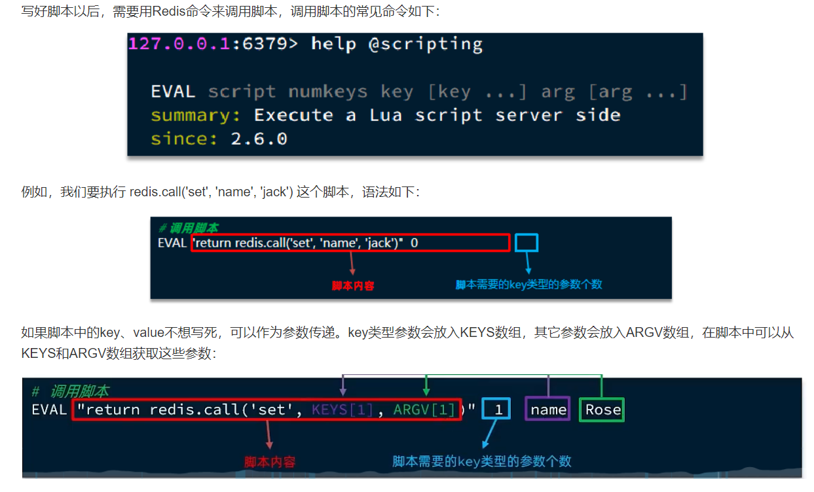

#### （2）lua 脚本实现

> #### 释放锁的业务流程是这样的
>
> #### 1、获取锁中的线程标示
>
> #### 2、判断是否与指定的标示（当前线程标示）一致
>
> #### 3、如果一致则释放锁（删除）
>
> #### 4、如果不一致则什么都不做

```lua
-- 这里的 KEYS[1] 就是锁的key，这里的ARGV[1] 就是当前线程标示
-- 获取锁中的标示，判断是否与当前线程标示一致
if (redis.call('GET', KEYS[1]) == ARGV[1]) then
  -- 一致，则删除锁
  return redis.call('DEL', KEYS[1])
end
-- 不一致，则直接返回
return 0
```

#### （3）Java 代码调用

```java
private static final DefaultRedisScript<Long> UNLOCK_SCRIPT;
    static {
        UNLOCK_SCRIPT = new DefaultRedisScript<>();
        UNLOCK_SCRIPT.setLocation(new ClassPathResource("unlock.lua"));
        UNLOCK_SCRIPT.setResultType(Long.class);
    }

public void unlock() {
    // 调用lua脚本
    stringRedisTemplate.execute(
            UNLOCK_SCRIPT,
            Collections.singletonList(KEY_PREFIX + name),
            ID_PREFIX + Thread.currentThread().getId());
}
```

## Redission

### 问题分析

> #### 基于 setnx 实现的分布式锁存在下面的问题
>
> #### 重入问题：重入问题是指获得锁的线程可以再次进入到相同的锁的代码块中，可重入锁的意义在于防止死锁，比如 HashTable 这样的代码中，他的方法都是使用 synchronized 修饰的，假如他在一个方法内，调用另一个方法，那么此时如果是不可重入的，不就死锁了吗？所以可重入锁他的主要意义是防止死锁，我们的 synchronized 和 Lock 锁都是可重入的
>
> #### 不可重试：是指目前的分布式只能尝试一次，我们认为合理的情况是：当线程在获得锁失败后，他应该能再次尝试获得锁
>
> #### 超时释放：我们在加锁时增加了过期时间，这样的我们可以防止死锁，但是如果卡顿的时间超长，虽然我们采用了 lua 表达式防止删锁的时候，误删别人的锁，但是毕竟没有锁住，有安全隐患
>
> #### 主从一致性：如果 Redis 提供了主从集群，当我们向集群写数据时，主机需要异步的将数据同步给从机，而万一在同步过去之前，主机宕机了，就会出现死锁问题

<br/>
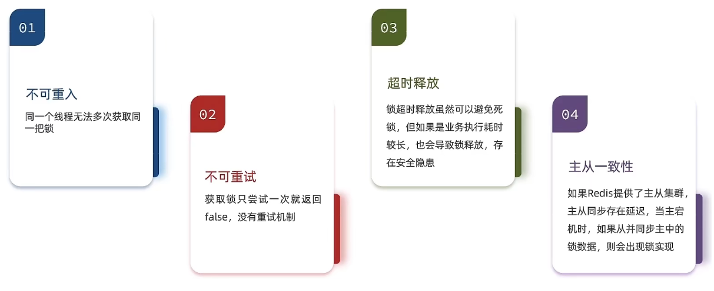

### 基本介绍

> #### Redisson 是一个在 Redis 的基础上实现的 Java 驻内存数据网格（In-Memory Data Grid），它不仅提供了一系列的分布式的 Java 常用对象，还提供了许多分布式服务，其中就包含了各种分布式锁的实现
>
> #### Redission提供了分布式锁的多种多样的功能，具体如下

<br/>
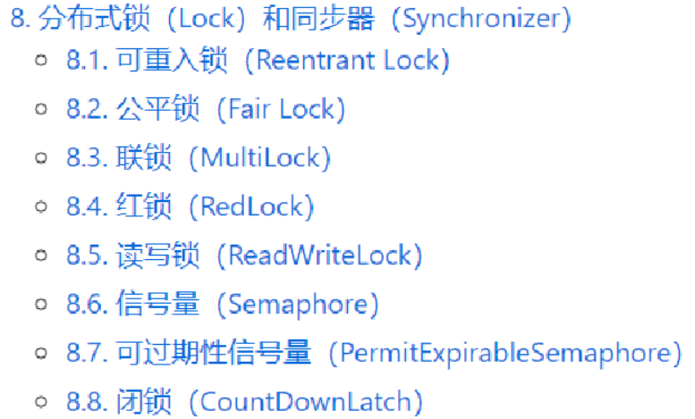

### 快速入门

#### （1）引入依赖

```xml
<dependency>
	<groupId>org.redisson</groupId>
	<artifactId>redisson</artifactId>
	<version>3.13.6</version>
</dependency>
```

#### （2）配置类

```java
@Configuration
public class RedissonConfig {

    @Bean
    public RedissonClient redissonClient(){
        // 配置
        Config config = new Config();
        config.useSingleServer().setAddress("redis://192.168.150.101:6379")
            .setPassword("123321");
        // 创建RedissonClient对象
        return Redisson.create(config);
    }
}
```

#### （3）业务实现

```java
@Resource
private RedissonClient redissonClient;

@Override
public Result seckillVoucher(Long voucherId) {
    // 1.查询优惠券
    SeckillVoucher voucher = seckillVoucherService.getById(voucherId);
    // 2.判断秒杀是否开始
    if (voucher.getBeginTime().isAfter(LocalDateTime.now())) {
        // 尚未开始
        return Result.fail("秒杀尚未开始！");
    }
    // 3.判断秒杀是否已经结束
    if (voucher.getEndTime().isBefore(LocalDateTime.now())) {
        // 尚未开始
        return Result.fail("秒杀已经结束！");
    }
    // 4.判断库存是否充足
    if (voucher.getStock() < 1) {
        // 库存不足
        return Result.fail("库存不足！");
    }

    Long userId = UserHolder.getUser().getId();

    //创建锁对象 这个代码不用了，因为我们现在要使用分布式锁
    //SimpleRedisLock lock = new SimpleRedisLock("order:" + userId, stringRedisTemplate);

    RLock lock = redissonClient.getLock("lock:order:" + userId);

    //获取锁对象
    //尝试获取锁，参数分别是：获取锁的最大等待时间(期间会重试)，锁自动释放时间，时间单位
    boolean isLock = lock.tryLock();

    //加锁失败
    if (!isLock) {
        return Result.fail("不允许重复下单");
    }
    try {
        //获取代理对象(事务)
        IVoucherOrderService proxy = (IVoucherOrderService) AopContext.currentProxy();
        return proxy.createVoucherOrder(voucherId);
    } finally {
        //释放锁
        lock.unlock();
    }
}
```

### 异步优化秒杀

<br/>
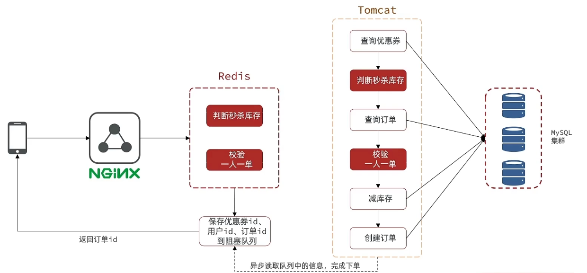

> #### 我们现在来看看整体思路：当用户下单之后，判断库存是否充足只需要导 redis 中去根据 key 找对应的 value 是否大于 0 即可，如果不充足，则直接结束，如果充足，继续在 redis 中判断用户是否可以下单，如果 set 集合中没有这条数据，说明他可以下单，如果 set 集合中没有这条记录，则将 userId 和优惠卷存入到 redis 中，并且返回 0，整个过程需要保证是原子性的，我们可以使用 lua 来操作
>
> #### 当以上判断逻辑走完之后，我们可以判断当前 redis 中返回的结果是否是 0 ，如果是 0，则表示可以下单，则将之前说的信息存入到到 queue 中去，然后返回，然后再来个线程异步的下单，前端可以通过返回的订单id来判断是否下单成功

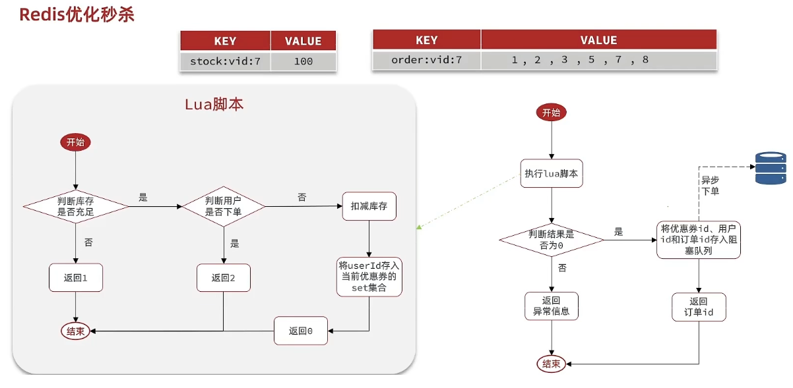

#### 优化思路

> #### 新增秒杀优惠券的同时，将优惠券信息保存到 Redis 中
>
> #### 基于 Lua 脚本，判断秒杀库存、一人一单，决定用户是否抢购成功
>
> #### 如果抢购成功，将优惠券 id 和用户 id 封装后存入阻塞队列
>
> #### 开启线程任务，不断从阻塞队列中获取信息，实现异步下单功能

### 代码实现

#### （1）lua 脚本

```lua
-- 1.参数列表
-- 1.1.优惠券id
local voucherId = ARGV[1]
-- 1.2.用户id
local userId = ARGV[2]
-- 1.3.订单id
local orderId = ARGV[3]

-- 2.数据key
-- 2.1.库存key
local stockKey = 'seckill:stock:' .. voucherId
-- 2.2.订单key
local orderKey = 'seckill:order:' .. voucherId

-- 3.脚本业务
-- 3.1.判断库存是否充足 get stockKey
if(tonumber(redis.call('get', stockKey)) <= 0) then
    -- 3.2.库存不足，返回1
    return 1
end
-- 3.2.判断用户是否下单 SISMEMBER orderKey userId
if(redis.call('sismember', orderKey, userId) == 1) then
    -- 3.3.存在，说明是重复下单，返回2
    return 2
end
-- 3.4.扣库存 incrby stockKey -1
redis.call('incrby', stockKey, -1)
-- 3.5.下单（保存用户）sadd orderKey userId
redis.call('sadd', orderKey, userId)
-- 3.6.发送消息到队列中， XADD stream.orders * k1 v1 k2 v2 ...
redis.call('xadd', 'stream.orders', '*', 'userId', userId, 'voucherId', voucherId, 'id', orderId)
return 0
```

#### （2）业务改造

```java
//异步处理线程池
private static final ExecutorService SECKILL_ORDER_EXECUTOR = Executors.newSingleThreadExecutor();

//在类初始化之后执行，因为当这个类初始化好了之后，随时都是有可能要执行的
@PostConstruct
private void init() {
    SECKILL_ORDER_EXECUTOR.submit(new VoucherOrderHandler());
}
// 用于线程池处理的任务
// 当初始化完毕后，就会去从对列中去拿信息
private class VoucherOrderHandler implements Runnable {

    @Override
    public void run() {
        while (true){
            try {
                // 1.获取队列中的订单信息
                VoucherOrder voucherOrder = orderTasks.take();
                // 2.创建订单
                handleVoucherOrder(voucherOrder);
            } catch (Exception e) {
                log.error("处理订单异常", e);
            }
        }
    }

    private void handleVoucherOrder(VoucherOrder voucherOrder) {
        //1.获取用户
        Long userId = voucherOrder.getUserId();
        // 2.创建锁对象
        RLock redisLock = redissonClient.getLock("lock:order:" + userId);
        // 3.尝试获取锁
        boolean isLock = redisLock.lock();
        // 4.判断是否获得锁成功
        if (!isLock) {
            // 获取锁失败，直接返回失败或者重试
            log.error("不允许重复下单！");
            return;
        }
        try {
            //注意：由于是spring的事务是放在threadLocal中，此时的是多线程，事务会失效
            proxy.createVoucherOrder(voucherOrder);
        } finally {
            // 释放锁
            redisLock.unlock();
        }
    }

    private BlockingQueue<VoucherOrder> orderTasks = new ArrayBlockingQueue<>(1024 * 1024);

    @Override
    public Result seckillVoucher(Long voucherId) {
        Long userId = UserHolder.getUser().getId();
        long orderId = redisIdWorker.nextId("order");
        // 1.执行lua脚本
        Long result = stringRedisTemplate.execute(
                SECKILL_SCRIPT,
                Collections.emptyList(),
                voucherId.toString(), userId.toString(), String.valueOf(orderId)
        );
        int r = result.intValue();
        // 2.判断结果是否为0
        if (r != 0) {
            // 2.1.不为0 ，代表没有购买资格
            return Result.fail(r == 1 ? "库存不足" : "不能重复下单");
        }
        VoucherOrder voucherOrder = new VoucherOrder();
        // 2.3.订单id
        long orderId = redisIdWorker.nextId("order");
        voucherOrder.setId(orderId);
        // 2.4.用户id
        voucherOrder.setUserId(userId);
        // 2.5.代金券id
        voucherOrder.setVoucherId(voucherId);
        // 2.6.放入阻塞队列
        orderTasks.add(voucherOrder);
        //3.获取代理对象
        proxy = (IVoucherOrderService)AopContext.currentProxy();
        //4.返回订单id
        return Result.ok(orderId);
    }

    @Transactional
    public  void createVoucherOrder(VoucherOrder voucherOrder) {
        Long userId = voucherOrder.getUserId();
        // 5.1.查询订单
        int count = query().eq("user_id", userId).eq("voucher_id", voucherOrder.getVoucherId()).count();
        // 5.2.判断是否存在
        if (count > 0) {
            // 用户已经购买过了
            log.error("用户已经购买过了");
            return ;
        }

        // 6.扣减库存
        boolean success = seckillVoucherService.update()
                .setSql("stock = stock - 1") // set stock = stock - 1
                .eq("voucher_id", voucherOrder.getVoucherId()).gt("stock", 0) // where id = ? and stock > 0
                .update();
        if (!success) {
            // 扣减失败
            log.error("库存不足");
            return ;
        }
        save(voucherOrder);
    }
}
```

### 问题分析

> #### 基于阻塞队列的异步秒杀存在内存限制问题、数据安全问题，后续基于 Redis 消息队列继续优化
