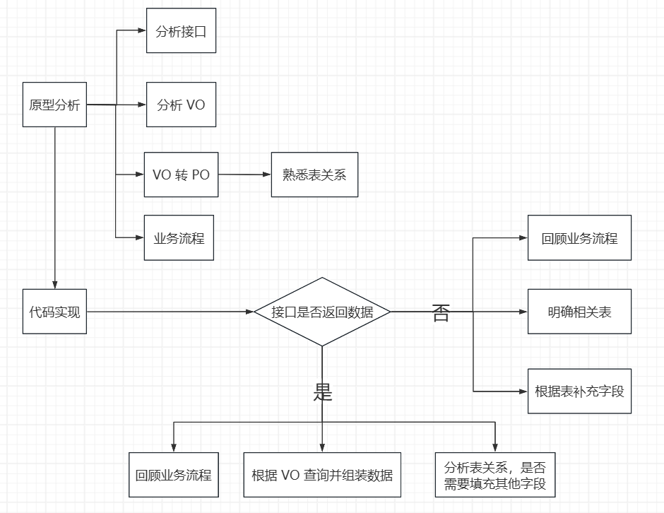
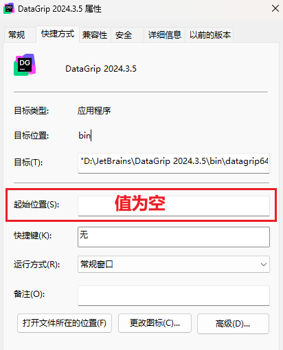

<h1 style="text-align: center; font-weight: bold;">随笔乱记</h1>

---

## 软件开发流程

<br/>


## Service 层编写思路

<br/>


## 忽略文件模板

```
######################################
# Cursor AI 忽略规则（项目根目录）
# 详细说明：https://docs.cursor.ac.cn/context/ignore-files
######################################

# ------------------------------------
# 敏感配置（尽最大努力从 AI 上下文/索引排除）
# ------------------------------------
# 环境变量文件
.env
.env.*
*.env

# 凭据/密钥
credentials.json
secrets.json
*.key
*.pem
*.jks
*.p12
*.keystore

# 本地配置/凭据
*.local
.local.env
.localsettings.json

# ------------------------------------
# Node/前端相关（不纳入 AI 分析）
# ------------------------------------
# Node 依赖
node_modules/
.pnp/
.pnp.js

# 构建/输出
dist/
build/
out/
public/   # 可按需保留 index.html 但忽略其他静态资产

# 缓存/工具
.cache/
.next/       # Next.js
.nuxt/       # Nuxt.js
.sass-cache/
.eslintcache/
parcel-cache/
.vite/
.storybook-static/

# 锁文件（根据团队选择，可选）
# 如果不希望忽略锁文件，则删除下面两个规则
package-lock.json
pnpm-lock.yaml
yarn.lock

# ------------------------------------
# Java 后端相关（Maven & Gradle）
# ------------------------------------
# Maven
target/
!.mvn/wrapper/maven-wrapper.jar   # 如果需要保留 Wrapper JAR 可取消注释

# Gradle
.gradle/
build/
!gradle/wrapper/gradle-wrapper.jar   # 保留 Gradle Wrapper 可执行文件

# Eclipse/STS 配置
.settings/
*.classpath
*.project

# IntelliJ/IDEA
*.iml
.idea/

# ------------------------------------
# 通用 IDE / 编辑器 / OS 文件
# ------------------------------------
.vscode/
.DS_Store
Thumbs.db
*.swp
*.swo
*.tmp
*.temp

# ------------------------------------
# 日志 & 运行时输出（AI 不需要分析）
# ------------------------------------
logs/
*.log
*.log.*
*.out
*.err

# Docker / Containers
docker-compose.override.yml
Dockerfile.*.local
*.dockerfile

# ------------------------------------
# 测试 & 临时/缓存
# ------------------------------------
coverage/
test-output/
*.coverage
*.cache

# JUnit / Test artifacts
*.class
*.jar
*.war
*.ear

# 二进制/编译产物
*.exe
*.dll
*.so
*.o
*.obj
*.bin

# ------------------------------------
# 媒体 / 大文件（无需索引/分析）
# ------------------------------------
*.zip
*.tar
*.gz
*.7z
*.rar
*.mp4
*.mov
*.mp3
*.wav
*.pdf
*.psd
*.ai

# ------------------------------------
# 例外规则（如果需要让 AI 索引/访问某些文件）
# ------------------------------------
# 取消忽略某些重要文档或配置模板
# !src/main/resources/application.yml
# !public/index.html
```

## 宝塔部署多项目

### 问题背景

> #### 在一个 HTML 项目中，通过配置 Nginx 配置文件实现在主域名后加上任意不同路径访问不同项目

### Nginx 配置

> #### 指定主域名后访问的路径，并指定该访问路径请求的资源目录

```bash
# 一定要包含域名和 IP
server_name 域名 服务器ip;

# ========== demo 子项目 ==========
# 访问 /demo 时统一跳到 /demo/
location = /demo {
    return 301 /demo/;
}

# /demo/ 作为 accompanySystem 的站点根
# 假设 Vite 已配置 base: '/demo/'，静态资源路径为 /demo/assets/...
location ^~ /demo/ {
    alias /www/wwwroot/accompanySystem/;
    index index.html index.htm;
}
# ========== demo 子项目结束 ==========
```

### vite.config.ts

> #### 在项目配置文件中配置 base 路径，即为主域名后的路径

```ts
export default defineConfig({
  // 指定部署子路径
  base: "/demo/",
  plugins: [vue(), vueDevTools()],
  resolve: {
    alias: {
      "@": fileURLToPath(new URL("./src", import.meta.url)),
    },
  },
  server: {
    proxy: {
      "/api": {
        target: "http://localhost:8080",
        changeOrigin: true,
        rewrite: (path) => path.replace(/^\/api/, ""),
      },
    },
  },
});
```

## JetBrains 软件启动问题

### 问题描述

> #### 24 版本系列的 JetBrains 软件启动后，在桌面弹出两个 ddl 插件

<br/>


### 解决方法

> #### 根本问题：激活脚本与新版本的不兼容问题，导致启动出现崩溃，建议采用激活码激活，删除 vm 文件中的 -javaagent 参数，采用激活码重新激活即可
>
> #### 解决方法：安装软件创建的快捷方式中的起始位置为空导致，删除桌面快捷方式，找到软件的安装的 bin 目录，右键 exe 文件重新发送快捷方式到桌面即可

<br/>
<div style="display:flex; gap:30px;">


</div>

## 首页动画加载闪屏问题

### 根因总结

```
这类问题本质不是“遮罩不够快”，而是 First Paint 前后的背景状态不连续。

常见根因：

1. 首帧背景和入场动画背景不一致

- 浏览器 First Paint 是一种颜色
- Vue Overlay / loader 是另一种颜色
- 两个阶段切换时就会闪

2. 最外层 Overlay 从 opacity: 0 开始

- 会短暂暴露底层页面
- 最外层全屏背景应从出现开始就是 opacity: 1
- 只让文字、线条、卡片、节点等内部元素做淡入动画

3. 暗色主题判断晚于 First Paint

- 浏览器先按照亮色背景绘制
- 随后才设置 html.dark
- 就会出现“亮色背景 → 暗色背景”的闪烁
- light / dark 必须在 First Paint 前同步确定

4. Dev 和 Production 的 HTML 生成机制可能不同

- 不要默认项目根 index.html 一定生效
- 必须检查浏览器实际收到的 HTML
- 例如 VitePress dev 可能不会立即注入 config 中的 head
- 如果 dev 缺少首屏 critical CSS，可检查 Vite transformIndexHtml，在 HTML 阶段提前注入

5. 多轮 AI 修复容易形成补丁堆积

- 不要不断增加 Overlay、important、mounted、setTimeout 等补丁
- 先明确每段代码负责哪个加载阶段
- 同一生命周期阶段只保留一套控制逻辑

## 经验总结

正确的首屏链路应该是：

同步判断 light / dark
→ 设置 html.dark
→ 设置首屏 blocking 状态
→ critical CSS 生效
→ First Paint 直接显示正确主题背景
→ Vue 挂载
→ Overlay 无缝接管
→ 内部元素播放入场动画
→ 正常首页

同一个主题下，应保证这些阶段视觉颜色一致：

# First Paint 背景

# blocking 背景

# loader 背景

# entrance 背景

Overlay 背景

旧主题能够避免闪烁的关键也不是单纯“加遮罩”，而是遮罩出现前后的背景颜色一致，所以用户看不到不同加载阶段之间的切换。

另外，相同颜色存在于多个位置不一定属于重复代码。如果它们分别负责 First Paint、loader、entrance、Overlay 等不同生命周期，就是合理的。

真正危险的是多个不同机制同时控制同一个阶段，例如：

config 控一次
→ 全局 CSS 再控一次
→ Layout 再控一次
→ mounted 再修改
→ setTimeout 再覆盖

这种情况应该清理，而不是继续增加新补丁。

```

### 通用修复提示词

```
修复当前项目首次加载、刷新或进入首页时背景短暂闪烁的问题。

不要看到闪烁就直接增加遮罩、setTimeout、mounted、important 或其他临时补丁。

先分析真实的首屏执行时间线：

HTML 返回
→ 同步初始化脚本
→ critical CSS
→ First Paint
→ 框架 JS 加载
→ Vue 挂载
→ Overlay
→ 入场动画

重点排查：

1. First Paint 时浏览器实际显示什么背景颜色。
2. light / dark 是否在 First Paint 前已经确定。
3. html.dark 是否设置得太晚，导致暗色主题先显示亮色背景。
4. 最外层全屏 Overlay 是否存在 opacity: 0 → 1，导致暴露底层背景。
5. First Paint、blocking、loader、entrance、Overlay 的背景颜色是否连续一致。
6. dev 和 production 实际返回的 HTML 是否不同。
7. 项目根 index.html 是否真的参与当前框架的页面生成，不要凭假设修改。
8. 是否存在之前多轮修复产生的重复背景、状态、class、mounted、延迟或覆盖代码。

修复原则：

- 修 First Paint 根因，不用动画掩盖问题。
- 主题判断必须在 First Paint 前同步完成。
- 如果框架已有主题检测逻辑，复用它真实使用的 localStorage、auto/light/dark 和 prefers-color-scheme 规则，不要创建第二套主题状态。
- 最外层全屏背景从出现开始保持 opacity: 1，只动画内部内容。
- 同一主题下保证 First Paint、blocking、loader、entrance、Overlay 背景视觉一致。
- dev 和 production 尽量共用同一份首屏初始化脚本和 critical CSS。
- 如果是 VitePress dev 初始 HTML 缺少 critical CSS，优先检查 Vite transformIndexHtml，在 First Paint 前注入，而不是继续修改 Vue mounted。
- 不修改 node_modules。
- 如果发现历史补丁重复控制同一生命周期，删除或合并，不继续覆盖。

如果问题已经修改过很多轮，修改前先做一次专项审查：

- 哪些代码负责 First Paint
- 哪些负责主题判断
- 哪些负责 Vue 挂载后的 Overlay
- 哪些是有效逻辑
- 哪些只是以前留下的无效补丁
- 是否存在多个机制同时控制同一个状态

修改完成后实际验证：

- light 首次访问
- light 强制刷新
- dark 首次访问
- dark 强制刷新
- auto + 系统 light
- auto + 系统 dark
- dev
- production preview

不能只根据代码推断“应该解决”，需要验证实际首次加载效果。

最终只汇报：

1. 真正根因
2. 闪烁具体发生在哪两个阶段之间
3. 修改了哪些文件
4. 是否删除了历史无效补丁
5. 当前 First Paint 前后的完整执行链路
6. light / dark / auto / dev / production 的验证结果
```
