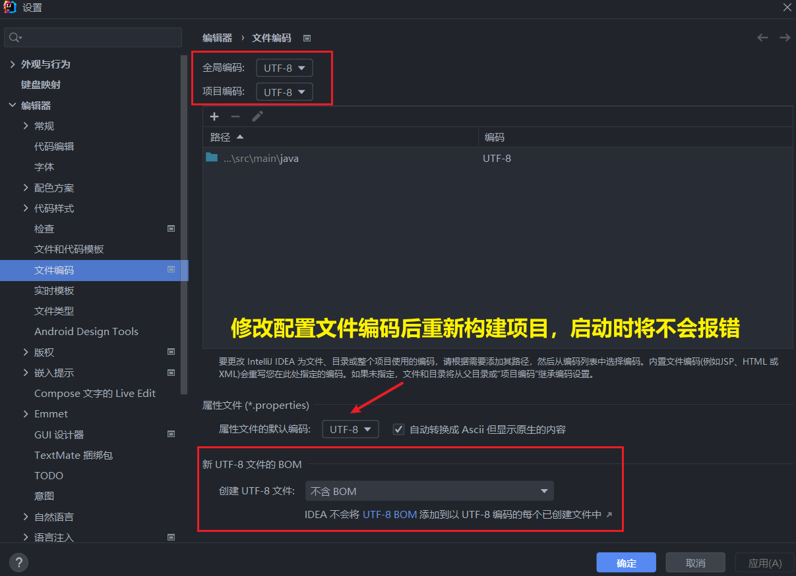

<h1 style="text-align: center;">工程搭建</h1>

---

## ⭐ 项目接口文档

> #### https://heuqqdmbyk.feishu.cn/wiki/GyZVwpRf6ir89qkKtFqc0HlTnhg

## 需要的相关依赖

> #### 创建 SpringBoot 工程，并引入 <span style="color:red">web 开发起步依赖、mybatis、mysql 驱动、lombok</span>


## ⚠️ 注意点

> #### 若 lombok 注解还是无法生效，按照 Springboot 案例中出现的问题解决方案相同，删配置 + 加版本

## 数据库准备

### SQL 语句

> #### 创建 tlias 数据库，并准备 dept 部门表

```sql
CREATE TABLE dept (
  id int unsigned PRIMARY KEY AUTO_INCREMENT COMMENT 'ID, 主键',
  name varchar(10) NOT NULL UNIQUE COMMENT '部门名称',
  create_time datetime DEFAULT NULL COMMENT '创建时间',
  update_time datetime DEFAULT NULL COMMENT '修改时间'
) COMMENT '部门表';

INSERT INTO dept VALUES (1,'学工部','2023-09-25 09:47:40','2024-07-25 09:47:40'),
                      (2,'教研部','2023-09-25 09:47:40','2024-08-09 15:17:04'),
                      (3,'咨询部','2023-09-25 09:47:40','2024-07-30 21:26:24'),
                      (4,'就业部','2023-09-25 09:47:40','2024-07-25 09:47:40'),
                      (5,'人事部','2023-09-25 09:47:40','2024-07-25 09:47:40'),
                      (6,'行政部','2023-11-30 20:56:37','2024-07-30 20:56:37');
```

### 配置 application.yml

> #### properties 文件层级不清晰，代码冗余，采用 yml 配置文件
>
> #### 需要自己替换的内容：项目名称、用户名、密码

```yml
spring:
  application:
    name: tlias-web-management
  #mysql连接配置
  datasource:
    driver-class-name: com.mysql.cj.jdbc.Driver
    url: jdbc:mysql://localhost:3306/tlias
    username: root
    password:
# 配置 mybatis 日志输出
mybatis:
  configuration:
    log-impl: org.apache.ibatis.logging.stdout.StdOutImpl
```

## 准备包结构及代码

### 基础包结构

<br/>


### 实体类 Dept

```java
package com.itheima.pojo;

import lombok.AllArgsConstructor;
import lombok.Data;
import lombok.NoArgsConstructor;

import java.time.LocalDateTime;

@Data
@NoArgsConstructor
@AllArgsConstructor
public class Dept {
    private Integer id;
    private String name;
    private LocalDateTime createTime;
    private LocalDateTime updateTime;
}
```

### ⭐ 统一响应结果 Result

```java
package com.itheima.pojo;

import lombok.Data;
import java.io.Serializable;

/**
 * 后端统一返回结果
 */
@Data
public class Result {

    private Integer code; //编码：1成功，0为失败
    private String msg; //错误信息
    private Object data; //数据

    public static Result success() {
        Result result = new Result();
        result.code = 1;
        result.msg = "success";
        return result;
    }

    public static Result success(Object object) {
        Result result = new Result();
        result.data = object;
        result.code = 1;
        result.msg = "success";
        return result;
    }

    public static Result error(String msg) {
        Result result = new Result();
        result.msg = msg;
        result.code = 0;
        return result;
    }

}
```

### DeptMapper

```java
package com.jacksonling.mapper;

import org.apache.ibatis.annotations.Mapper;

@Mapper
public interface DeptMapper {
}
```

### DeptService

```java
package com.jacksonling.service;

public interface DeptService {
}
```

### DeptServiceImpl

```java
package com.jacksonling.service.impl;

import com.jacksonling.service.DeptService;
import org.springframework.stereotype.Service;

@Service
public class DeptServiceImpl implements DeptService {
}
```

### DeptController

```java
package com.jacksonling.controller;

import org.springframework.web.bind.annotation.RestController;

/**
 * 部门管理控制层
 */
@RestController
public class DeptController {
}
```

## ⚠️ 修改文件编码



## 检查工作

> #### （1）检查项目的编码，全部配置 UTF-8，尤其是 yml 文件编码
>
> #### （2）检查项目配置的 JDK 版本
>
> #### （3）检查项目的 Maven 配置
